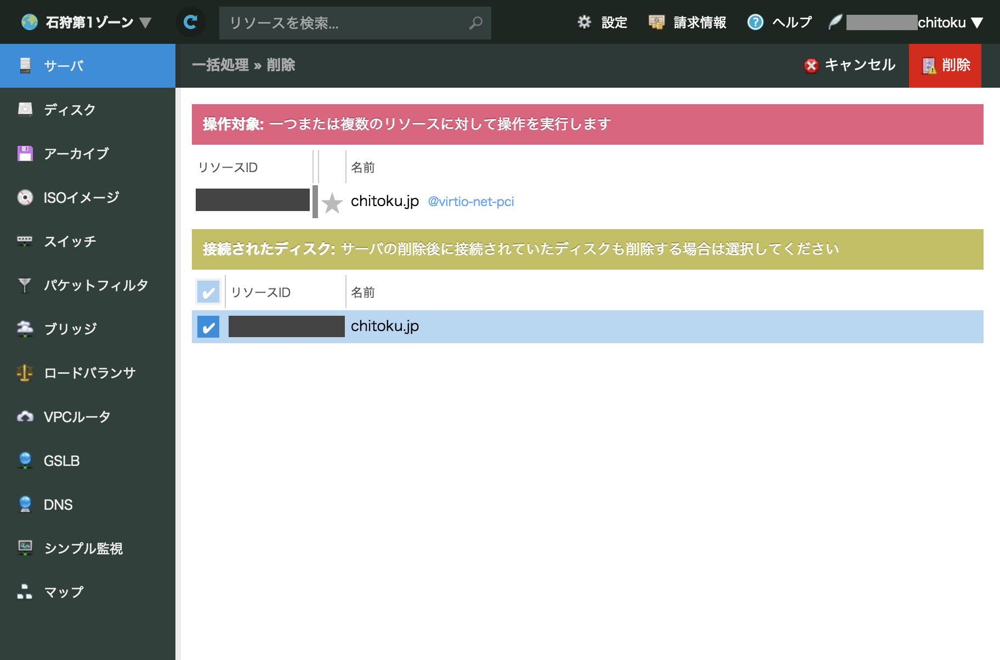
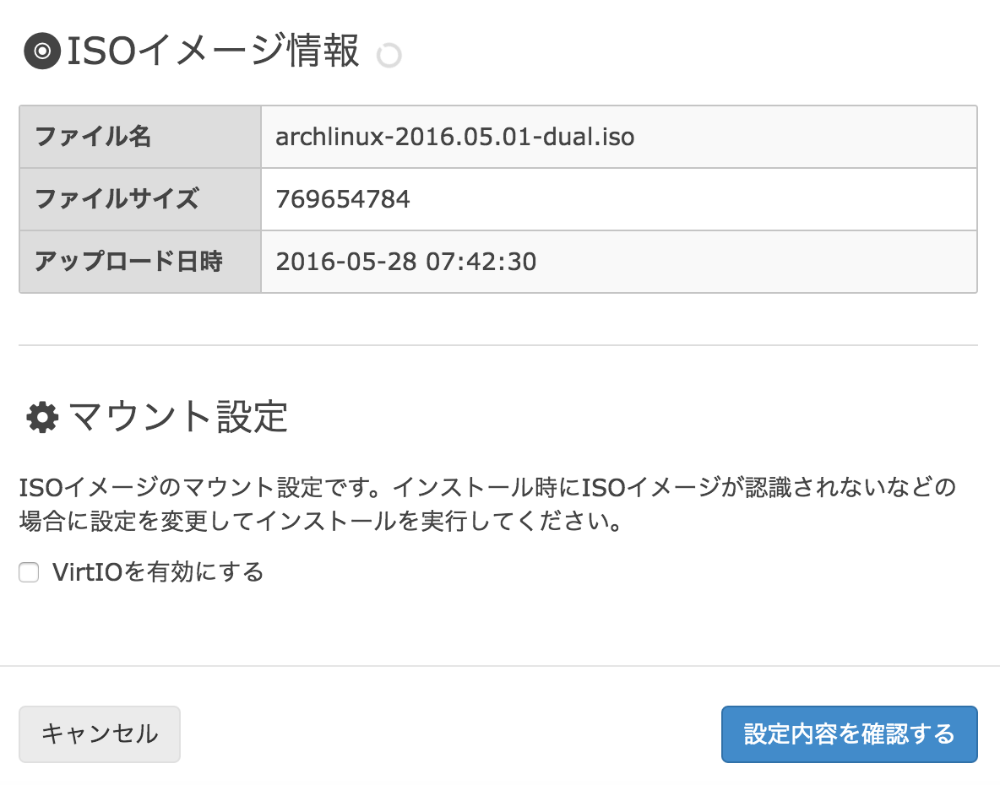

2015 年の夏に取得したさくらのクラウドのクーポンが切れてしまったので、お金がかかるのもあってひとまず解約しました。



さくらのクラウドでは Antergos を利用して Arch Linux のインストールを行いましたが、
「Antergos は甘え」という意見を受けたため[*要出典*]、
今回は人生初の [#ArchLinuxInstallBattle](https://twitter.com/search?q=#ArchLinuxInstallBattle) に挑戦する運びとなりました。はー、こわ………。

<!-- more -->

それから深夜のノリでさくらの VPS を契約しました。
ConoHa はキャラクターが可愛いことが主な特徴ですが、ぼくは別におたくではないので（←重要）さくらインターネットでいいんです。

当初は数年前に書かれたさくらの VPS への Arch Linux のインストール記事を参考にして進めようとしましたが、状況が変わっていたのかうまくいかない部分があったため、ArchWiki 一本に絞って作業しました。ArchWiki 神。

基本的には [インストールガイド – ArchWiki](https://wiki.archlinux.jp/index.php/インストールガイド) を読めばうまくいくので細かな手順は割愛しますが、ハマったところだけメモしておきます。

## ハマったところ

さくらの VPS のコントロールパネルで [OS インストール] → [ISO イメージインストール] を選択してインストール作業に入る際に [VirtIO を有効にする] にチェックが入っていると、以下のようなエラーが出てパーティションを切る作業が進められませんでした。

```
SQUASHFS error: Unable to read fragment cache entry
```



## 騙されやすいやつ

コントロールパネルの [ネットワークインターフェース] に記載のインターフェイス名は、最近の Arch Linux の場合はページに記載のものと一致していません。`bash¦ip link` して MAC アドレスで調べましょう。

## 勝利

<twitter-tweet id="736877915049066496"></twitter-tweet>

デフォルトで vim すらバンドルされていないミニマムさに驚きながら、無言で前のサーバーの pacman から書きだしたパッケージ一覧を押し込んで作業完了でした。おしまい。
