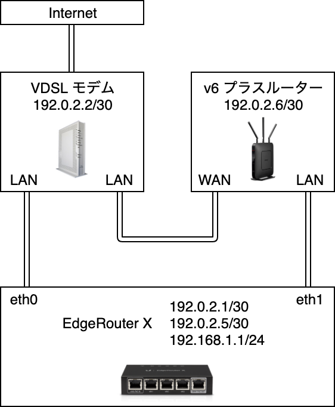
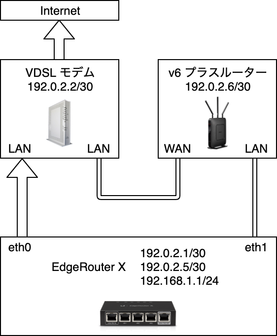

## ロードバランサーとは

EdgeOS は標準で WAN へのロードバランサー機能を搭載しており、パケットのルーティング先を予め指定した方法でインターフェイスごとに振り分けることができます[^1]。
たとえば複数の回線を契約しているような[逸般の誤家庭](https://twitter.com/hashtag/%E9%80%B8%E8%88%AC%E3%81%AE%E8%AA%A4%E5%AE%B6%E5%BA%AD)で負荷をそれぞれに分散させたり、一方の回線が利用できなくなったときにもう一方の回線に自動で切り替えたり、といったユースケースがあります。

この記事では [So-net 光](https://www.so-net.ne.jp/access/hikari/) を契約している我が家（VDSL 😢）で、フレッツ光の PPPoE 方式による接続と [v6 プラス](https://www.so-net.ne.jp/access/hikari/v6plus/) を EdgeRouter から利用しつつ、v6 プラスが利用できないときに PPPoE 接続にフォールバックさせるように設定してみます。

## v6 プラスのデメリット

v6 プラスを利用している場合、特定のポート番号を使用するサービスが IPv4 で利用できなくなります。
しかしながらこの記事の方法を使用すると、EdgeRouter からルーティングされるパケットをロードバランシングから除外することで PPPoE がそのまま利用できるため、L2TP や IPsec などを引き続き利用することができます。

So-net による v6 プラスの説明では以下のようにサービスの制約として説明されています[^2]。これは v6 プラスが一つのアドレスを複数のユーザーで共有するサービスであるため、特定のポートを専有することができないことに起因する問題です。

> 「v6プラス」をご利用の場合、「固定IPサービス」は利用できません。
>
> ※PPPoEのIPv4を有効化いただくことでご利用可能です。 (詳しくは[「v6プラス」 （IPoE方式でのIPv4通信)）を無効にする （または有効にする） 方法を知りたい](https://support.so-net.ne.jp/supportsitedetailpage?id=000013893))  
> 　また、以下に該当するサービスについても、ご利用いただけない場合があります。
>
> - 特定のプロトコル (PPTP、SCTP) を利用するサービス
> - 利用可能なポート番号が制限されているため、特定のポートを使うサービス
> - IPv4グローバルアドレスを共有するネットワークでは利用できないサービス

<!-- more -->

## 環境

+------------+-------------------------------------------------------------------------+
| **EdgeRouter**                                                                       |
+------------+-------------------------------------------------------------------------+
| モデル     | EdgeRouter X 5-Port                                                     |
+------------+-------------------------------------------------------------------------+
| EdgeOS     | v1.10.9                                                                 |
+------------+-------------------------------------------------------------------------+
| Linux      | ubnt 3.10.107-UBNT                                                      |
+------------+-------------------------------------------------------------------------+
| <br />**v6 プラスルーター**                                                          |
+------------+-------------------------------------------------------------------------+
| モデル     | [WXR-1750DHP2](https://www.buffalo.jp/product/detail/wxr-1750dhp2.html) |
+------------+-------------------------------------------------------------------------+
| バージョン | v2.54                                                                   |
+------------+-------------------------------------------------------------------------+
| <br />**VDSL モデム**                                                                |
+------------+-------------------------------------------------------------------------+
| モデル     | [RV-230NE](https://web116.jp/shop/hikari_r/rv_230ne/rv_230ne_00.html)   |
+------------+-------------------------------------------------------------------------+
| バージョン | v18.35                                                                  |
+------------+-------------------------------------------------------------------------+


## 構成

v6 プラスに対応したルーターは JPNE のメーカー確認機種一覧[^3]を参考に用意します。

### 接続

EdgeRouter は eth0 から VDSL モデム、eth1 から v6 プラスルーターに直結しています。  
VDSL モデム と v6 プラスルーターは別々のサブネットになるように構成します。



### PPPoE 接続時のルーティング

この構成で PPPoE に接続するときは次の経路でルーティングします。  
EdgeRouter（192.168.1.1/24）→ VDSL モデム（192.0.2.2/30）→ IPv4



### v6 プラス接続時のルーティング

v6 プラスで接続するときは次の経路でルーティングします。  
EdgeRouter（192.168.1.1/24）→ v6 プラスルーター（192.0.2.6/30）→ IPv6

この経路では IPv6 へのカプセリングが v6 プラスルーターで行われるため v6 プラスルーターの WAN 端子以降は IPv6 パケットになります。
VDSL モデムと v6 プラスルーターに正しいグローバル IPv6 アドレスが割り振られている必要があります（通常は問題ありません）。


ロードバランシングを行う場合はこのようにサブネットを各ルーターで分離しておかないと正しくルーティングされないので注意が必要です。

## PPPoE の設定

フレッツ光の PPPoE 接続に必要な設定を行います。ロードバランシングには使われず、EdgeRouter から直接インターネットに出る場合に使われる設定です。
MTU と MSS の設定がフレッツ光の場合は別途必要なので注意が必要です[^4]。

```bash
$ configure
$ set interfaces ethernet eth0 pppoe 0 password ****************
$ set interfaces ethernet eth0 pppoe 0 user-id ********************
$ commit; save
```

## ルーティング・テーブルの設定

続いて、ロードバランサーが使用するルーティング・テーブルを定義します。  
ここでは `table 1` を PPPoE 接続に使用するルーティングとして `next-hop` に VDSL モデムに設定し、
`table 2` を v6 プラスの接続に使用するルーティングとして `next-hop` に v6 プラスルーターに設定しています。
このほか VPN 接続などの個別のルートがある場合はそれぞれのテーブルに設定します。

```bash
$ configure
$ set protocols static table 1 description PPPoE
$ set protocols static table 1 route 0.0.0.0/0 next-hop 192.0.2.2
$ set protocols static table 2 description v6plus
$ set protocols static table 2 route 0.0.0.0/0 next-hop 192.0.2.6
$ commit; save
```

## ロードバランスの設定

先ほど定義したルーティング・テーブルをロードバランサーに設定していきます。  
ここでは `WAN_FAILOVER` という名前でロードバランシングを定義し、それぞれのインターフェイスに該当するルーティング・テーブルを設定しています。
`eth0` に `failover-only` を設定することで、EdgeRouter にルーティングされてきたパケットには普段は `eth1` に設定された v6 プラス用のルーティング・テーブルが使用され、`eth1` が使用できない場合に `eth0` の PPPoE 接続にフォールバックするようになります。

また `lb-local` の部分を `enable` に変更すると、EdgeRouter 自体がインターネットに接続する経路にもこのロードバランサーを使用するように指定できます。
上述の通り v6 プラスでは VPN などのサービスが使用できなくなるため、特有のポート番号を使用するサーバーを使用している場合は無効にする必要があります。

```bash
$ configure
$ set load-balance group WAN_FAILOVER interface eth0 failover-only
$ set load-balance group WAN_FAILOVER interface eth0 route table 1
$ set load-balance group WAN_FAILOVER interface eth1 route table 2
$ set load-balance group WAN_FAILOVER lb-local disable
$ set load-balance group WAN_FAILOVER lb-local-metric-change disable
$ commit; save
```

## ファイアウォールの設定

最後に、定義したロードバランサー `WAN_FAILOVER` をファイアウォールのルールに設定します。  
ここでは `eth1` の配下にあるクライアントからのパケットをロードバランシングの対象にしていますが、他のインターフェイスや `switch0` などでも正常に動作します。

```bash
$ configure
$ set firewall modify LAN_PBR rule 10 modify lb-group WAN_FAILOVER
$ set interfaces ethernet eth1 firewall in modify LAN_PBR
$ commit; save
```

## 最後に

EdgeRouter は現在のところ MAP-E に対応していないため、v6 プラスに対応させるためには別の対応ルーターを繫いだほうが簡単にセットアップできます。
このようにロードバランサーによる構成で運用すると、v6 プラス側でトラブルがあったときにも PPPoE で接続されるためダウンタイムを十数秒程度に抑えられます。

一方でヤマハのルーターの中には MAP-E に対応している機器もあり[^5]、タグ付 VLAN を用いて PPPoE と v6 プラスへの振り分けを行うような構成も行えるようです[^6]。

## 脚注

[^1]: [EdgeRouter - WAN Load-Balancing  Ubiquiti Help Center](https://help.ui.com/hc/en-us/articles/205145990-EdgeRouter-WAN-Load-Balancing)
[^2]: [次世代通信 v6プラス | So-net (ソネット)](https://www.so-net.ne.jp/access/hikari/v6plus/)
[^3]: [【VNEサービス】v6プラス(IPv6/IPv4インターネットサービス) | 株式会社JPIX](https://www.jpne.co.jp/service/v6plus/#v6pbbr)
[^4]: [EdgeRouter X をなるべくCLIで設定する #Network - Qiita](https://qiita.com/maiani/items/08dbfbd9e6663da86079#%E3%83%95%E3%83%AC%E3%83%83%E3%83%84%E5%85%89%E5%90%91%E3%81%91%E8%A8%AD%E5%AE%9Amtumss)
[^5]: [v6プラス対応機能](https://www.rtpro.yamaha.co.jp/RT/docs/v6plus/)
[^6]: [IPv4でPPPoEとDS-Lite/MAP-Eを併用しよう](https://www.marbacka.net/blog/ipv4_pppoe_ds-lite_simultaneously/#n002)
