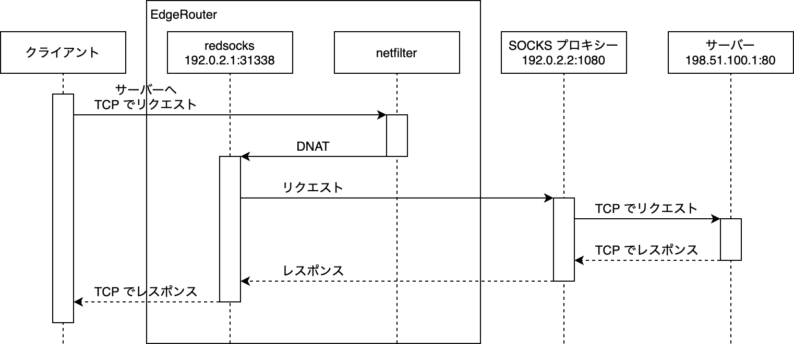

## 概要

SOCKS プロキシーは OpenSSH などで手軽に建てられるプロキシーの一つですが、[redsocks](https://github.com/darkk/redsocks) を使用することで TCP のパケットが透過的に SOCKS プロキシーを経由するように設定することができます。今回は [EdgeRouter X](https://store.ui.com/us/en/products/er-x) に redsocks をインストールし、LAN 内のコンピューターから特定の宛先への TCP 通信と名前解決が透過的に SOCKS プロキシーを経由するように設定してみます。

## redsocks とは

redsocks は TCP パケットを受け取り、SOCKS/HTTPS プロキシーを通過させて返すソフトウェアです。iptables の [REDIRECT](https://ipset.netfilter.org/iptables-extensions.man.html#lbDK) や [DNAT](https://ipset.netfilter.org/iptables-extensions.man.html#lbCU) と組み合わせて、redsocks の動作しているポートにプロキシーを通過させたいパケットを転送して使用します。このとき、iptables が REDIRECT や DNAT で付け替える前の本来の宛先アドレスや宛先ポートは、`c¦getsockopt()` でソケットを取得する際の `c¦SO_ORIGINAL_DST` というオプションによって取得されるため[^1]、iptables のルールを設定するホストと redsocks が動作するホストは同一のマシンである必要があります。

## TCP の場合

iptables の DNAT ルールによって redsocks に向けられたパケットが SOCKS プロキシーに転送されます。

<!-- more -->



この図では iptables で以下のコマンドを実行した状態を表しています。

```bash
$ iptables \
      -t nat \
      -A PREROUTING \
      -p tcp \
      -d '198.51.100.0/24' \
      -j DNAT --to-destination '192.0.2.1:31338'
```

## UDP の場合

すべての SOCKS プロキシーの実装が UDP のパケットのプロキシーに対応しているわけではなく、例えば OpenSSH は UDP に対応していません。redsocks では用途を DNS に限定した dnstc や dnsu2t という DNS サーバーとして動作するソフトウェアが提供されています。

### dnstc

dnstc は問い合わせに対して常に TC ビットを立てた UDP の応答を返すことで、TCP フォールバックによって DNS クライアントが同じ問い合わせを TCP で再送する動作を利用したものです。TC ビットが立てられた応答を受け取ったクライアントは、上記の流れに従って 53/tcp で SOCKS プロキシー経由で問い合わせることになります。


DNS クライアントが問い合わせごとに UDP と TCP で 1 回ずつリクエストを行うオーバーヘッドがあるため、ここでは dnstc については扱いません。

### dnsu2t

dnsu2t は UDP による問い合わせを TCP で多重化し、予め指定しておいた DNS サーバーに対してプロキシー経由で問い合わせを行うものです。DNS クライアントから見たとき、dnsu2t と違ってこのソフトウェアからの応答は UDP になります。今回はこちらを利用します。


この図では iptables で上記の TCP のコマンドに加えて、以下のコマンドも実行した状態を表しています。

```bash
$ iptables \
      -t nat \
      -A PREROUTING \
      -p udp \
      -d '198.51.100.0/24' \
      --dport 53 \
      -j DNAT --to-destination '127.0.0.1:5300'
```

また EdgeRouter を DNS キャッシュサーバーとして利用している場合、相手の DNS サーバーを予め指定しておくことで透過的に問い合わせに返答させることができます。


## redsocks をビルドする

redsocks は Debian のリポジトリーでも提供されていますが、開発が進んでいるにも関わらず GitHub 上のリリースは v0.5 で途絶えています[^2]。リリースされているバージョンでは後述する dnsu2t が含まれていないため、本記事では自前でビルドしたものを使用します。

今回は、EdgeRouter で動作する MIPSEL アーキテクチャー向けにクロスコンパイルするための Docker イメージ（[chitoku-k/redsocks-edgerouter-mediatek](https://github.com/chitoku-k/redsocks-edgerouter-mediatek)）を作成しました。この Docker イメージをビルドすると `redsocks` のバイナリーが得られるので EdgeRouter の `/usr/sbin` に配置します。

systemd の Unit も作成しておきます。

```bash
$ sudo vi /etc/systemd/system/redsocks.service
$ sudo systemctl daemon-reload
```

```ini
[Unit]
Description=Redsocks transparent SOCKS proxy redirector
Wants=vyatta-router.service
After=network.target auditd.service vyatta-router.service

[Service]
ExecStart=/usr/sbin/redsocks -c /etc/redsocks.conf
KillMode=process
Restart=on-failure
RestartSec=1s

[Install]
WantedBy=multi-user.target
Alias=redsocks.service
```

## 設定手順: TCP 編

まず redsocks の設定ファイルを編集して、systemd の unit を開始します。

```bash
$ sudo vi /etc/redsocks.conf
$ sudo systemctl start redsocks
```

`ip` と `port` には LAN 内のコンピューターからの通信を経由させたい SOCKS プロキシーを設定します。

```nginx
base {
    log = stderr;
    daemon = off;
    redirector = iptables;
}

redsocks {
    local_ip = 0.0.0.0;
    local_port = 31338;

    ip = 192.0.2.2;
    port = 1080;

    type = socks5;
}
```

続いて LAN 内のコンピューターからの TCP の通信に DNAT を適用して redsocks へ向けます。  
LAN（`eth1`）から `198.51.100.0/24` 宛の TCP の通信を `192.0.2.1:31338` に向ける例です。

```bash
$ configure

$ set service nat rule 10 inbound-interface eth1
$ set service nat rule 10 protocol tcp
$ set service nat rule 10 destination
$ set service nat rule 10 destination address '198.51.100.0/24'
$ set service nat rule 10 inside-address address '192.0.2.1'
$ set service nat rule 10 inside-address port 31338

$ commit; save
```

EdgeRouter が送信元となるパケットをプロキシーの対象としなくて良い場合はここまでで完了です。

EdgeRouter を DNS キャッシュサーバーとして利用している等の理由で EdgeRouter 自身からのパケットも対象としたい場合は、`/config/scripts/post-config.d/` 以下に iptables の設定をシェルスクリプトとして保存しておきます。

```bash
$ sudo vi /config/scripts/post-config.d/update-iptables
$ sudo chmod 755 /config/scripts/post-config.d/update-iptables
```

```bash
#!/bin/bash
sudo iptables -t nat -A OUTPUT -p tcp -d '198.51.100.0/24' -j DNAT --to-destination '192.0.2.1:31338'
```

## 設定手順: UDP 編（DNS のみ）

プロキシーの接続先が独自の名前解決を必要としている場合は DNS クエリーもプロキシーを経由させる必要があります。EdgeRouter を DNS キャッシュサーバーとして利用している場合は、上記の TCP の設定手順で EdgeRouter が送信元となるパケットがプロキシーの対象となるように設定しておく必要があります。

まず redsocks の設定ファイルに以下の内容を追記して systemd の unit を再起動します。

```bash
$ sudo vi /etc/redsocks.conf
$ sudo systemctl restart redsocks
```

```nginx
dnsu2t {
    local_ip = 127.0.0.1;
    local_port = 5300;

    remote_ip = 192.51.100.254;
    remote_port = 53;
}
```

DNS サーバーが EdgeRouter 自身である場合は `local_ip` を `127.0.0.1` に設定し、`remote_ip` と `remote_port` にはプロキシーの接続先で利用されている DNS の IP アドレスとポート番号を設定します。

続いて LAN 内のコンピューターからの DNS の問い合わせに DNAT を適用して dnsu2t に向けます。

```bash
$ configure

$ set service nat rule 20 inbound-interface eth1
$ set service nat rule 20 protocol udp
$ set service nat rule 20 destination
$ set service nat rule 20 destination address '198.51.100.0/24'
$ set service nat rule 20 inside-address address '192.0.2.1'
$ set service nat rule 20 inside-address port 5300

$ commit; save
```

DNS サーバーが EdgeRouter 自身である場合、以下のように設定しておくと LAN 内のコンピューターが EdgeRouter に特定のドメイン名を問い合わせた際に透過的に dnsu2t を利用して結果が返るようになります。

```bash
$ configure

$ set service dns forwarding options 'server=/private.example.com/127.0.0.1#5300'
$ set service dns forwarding options 'server=/secret.example.com/127.0.0.1#5300'

$ commit; save
```

この例では `private.example.com` か `secret.example.com` で終わるドメイン名の DNS 問い合わせがプロキシーの対象になります。

## 動作確認

ここまでで設定は完了です。LAN 配下のコンピューターから以下の手順を行うことで設定の検証ができます。

### TCP

TCP の設定のみの場合は `curl` や `ssh` などが IP アドレスによる指定で疎通することや、TCP による `dig` で名前解決が行えることを確認します。

```bash
$ curl -H 'Host: private.example.com' 'http://198.51.100.1'
```

```bash
$ dig +tcp 'private.example.com' @198.51.100.254
```

### UDP

EdgeRouter を DNS キャッシュサーバーとして利用している構成で DNS の設定も行った場合は `curl` や `ssh` などが名前によるホスト指定で疎通することを確認します。

```bash
$ curl 'http://private.example.com'
```

また、EdgeRouter が DNS キャッシュサーバーでない場合でも UDP による `dig` で名前解決が行えることを確認します。

```bash
$ dig 'private.example.com' @198.51.100.254
```

## 脚注

[^1]: [iptablesでREDIRECTする前のポート番号を取得する - ももいろテクノロジー](https://inaz2.hatenablog.com/entry/2016/03/31/192037)
[^2]: [Tags · darkk/redsocks · GitHub](https://github.com/darkk/redsocks/tags)
