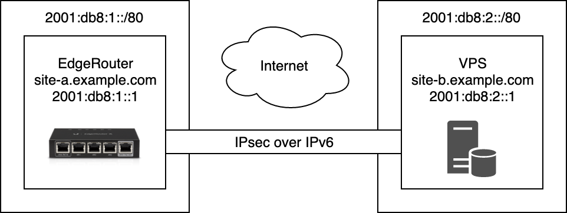

EdgeRouter X と Linux サーバーを IPsec over IPv6 の拠点間 VPN で接続する方法です。

So-net 光 プラスは、フレッツ光とプロバイダー契約がセットになっているいわゆる光コラボサービスで、IPv4 が PPPoE で提供されているという特徴があります。
そのため、グローバル IP アドレスが頻繁に変更されたり、NGN 網終端装置の輻輳の影響を受けたり[^1]といった問題があり、IPv6 接続のほうがより安定して VPN 接続を構成することができます。
このサービスの IPv6 アドレスはあくまでも半固定ですが[^2] IPv6 アドレスの変更頻度は低く、DDNS などを設定しておけば十分に実用できます。

<!-- more -->

## 環境

+------------+------------------------------------------------------+
| **EdgeRouter 側**                                                 |
+------------+------------------------------------------------------+
| 回線       | [So-net 光](https://www.so-net.ne.jp/access/hikari/) |
+------------+------------------------------------------------------+
| ひかり電話 | あり                                                 |
+------------+------------------------------------------------------+
| モデル     | EdgeRouter X 5-Port                                  |
+------------+------------------------------------------------------+
| EdgeOS     | v2.0.4                                               |
+------------+------------------------------------------------------+
| Linux      | 4.14.54-UBNT                                         |
+------------+------------------------------------------------------+
| strongSwan | swanctl 5.6.3                                        |
+------------+------------------------------------------------------+
| <br />**Linux サーバー側**                                        |
+------------+------------------------------------------------------+
| サーバー   | [さくらの VPS](https://vps.sakura.ad.jp/)            |
+------------+------------------------------------------------------+
| OS         | Arch Linux                                           |
+------------+------------------------------------------------------+
| Linux      | 5.1.16-arch1-1-ARCH                                  |
+------------+------------------------------------------------------+
| strongSwan | swanctl 5.8.0                                        |
+------------+------------------------------------------------------+

## 構成

2001:db8:1::1 の EdgeRouter と 2001:db8:2::1 の VPS を図のように接続する例です。  
なお、実際にはさくらの VPS は /64 な IPv6 アドレスを一つしか割り当てません。



## EdgeRouter 側の設定

CLI から設定を行います。ここでは IKEv2 で設定しています。  
また、EdgeRouter 側をイニシエーター（`connection-type initiate`）としています。

```bash
$ configure

# ESP の構成
$ set vpn ipsec esp-group ESP-1 compression disable
$ set vpn ipsec esp-group ESP-1 lifetime 86400
$ set vpn ipsec esp-group ESP-1 mode tunnel
$ set vpn ipsec esp-group ESP-1 pfs enable
$ set vpn ipsec esp-group ESP-1 proposal 1 encryption aes128
$ set vpn ipsec esp-group ESP-1 proposal 1 hash sha1

# IKE の構成
$ set vpn ipsec ike-group IKE-1 ikev2-reauth yes
$ set vpn ipsec ike-group IKE-1 key-exchange ikev2
$ set vpn ipsec ike-group IKE-1 lifetime 86400
$ set vpn ipsec ike-group IKE-1 proposal 1 dh-group 14
$ set vpn ipsec ike-group IKE-1 proposal 1 encryption aes128
$ set vpn ipsec ike-group IKE-1 proposal 1 hash sha1

# ピアの構成
$ set vpn ipsec site-to-site peer site-b.example.com authentication id site-a.example.com
$ set vpn ipsec site-to-site peer site-b.example.com authentication remote-id site-b.example.com
$ set vpn ipsec site-to-site peer site-b.example.com authentication mode pre-shared-secret
$ set vpn ipsec site-to-site peer site-b.example.com authentication pre-shared-secret XXXXXXXXXXXXXXXX
$ set vpn ipsec site-to-site peer site-b.example.com connection-type initiate
$ set vpn ipsec site-to-site peer site-b.example.com ike-group IKE-1
$ set vpn ipsec site-to-site peer site-b.example.com ikev2-reauth inherit
$ set vpn ipsec site-to-site peer site-b.example.com local-address '2001:db8:1::1'
$ set vpn ipsec site-to-site peer site-b.example.com tunnel 1 allow-nat-networks disable
$ set vpn ipsec site-to-site peer site-b.example.com tunnel 1 allow-public-networks disable
$ set vpn ipsec site-to-site peer site-b.example.com tunnel 1 esp-group ESP-1
$ set vpn ipsec site-to-site peer site-b.example.com tunnel 1 local prefix '2001:db8:1::/80'
$ set vpn ipsec site-to-site peer site-b.example.com tunnel 1 remote prefix '2001:db8:2::/80'

$ commit; save
```

## Linux サーバー側の設定

/etc/swanctl/swanctl.conf を記述します。EdgeRouter 側に合わせて IKEv2 で設定します。  
Linux サーバー側はレスポンダー（`start_action = trap`）としています。

```
connections {
    site-a {
        version = 2
        rekey_time = 24h

        proposals = aes128-sha1-modp2048

        local_addrs = site-b.example.com
        remote_addrs = site-a.example.com

        local {
            id = site-b.example.com
            auth = psk
        }
        remote {
            id = site-a.example.com
            auth = psk
        }
        children {
            site-a {
                start_action = trap
                esp_proposals = aes128-sha1-modp2048

                local_ts = 2001:db8:2::/80
                remote_ts = 2001:db8:1::/80
            }
        }
    }
}

secrets {
    ike-site-a {
        secret = XXXXXXXXXXXXXXXX
        id-site-a = site-a.example.com
    }
}
```

## おわりに

拠点間 VPN では、イニシエーターとレスポンダーの設定を一致させる必要がありますが、
EdgeOS の設定と strongSwan の設定で記述方法が異なる部分があります。
たとえば、EdgeOS では IKE の DH グループの番号を `14` のように指定しますが、
strongSwan ではキーワードを使用して `modp2048` のように指定します。

strongSwan のドキュメントに暗号スイートの一覧[^3]が掲載されているのでこれを参照するのが吉です。

## 脚注

[^1]: [固定回線でも「ギガ不足」におびえる時代が到来か、トラフィック急増により現場で起きている悲劇とは：ものになるモノ、ならないモノ（81）（1/2 ページ） - ＠IT](https://atmarkit.itmedia.co.jp/ait/articles/1902/19/news013.html)
[^2]: [「超軽量」VPNを試してみよう、フレッツIPv6オプションで：羽ばたけ！ネットワークエンジニア（13）（1/2 ページ） - ＠IT](https://atmarkit.itmedia.co.jp/ait/articles/1902/25/news018.html)
[^3]: [IKEv2 Cipher Suites :: strongSwan Documentation](https://docs.strongswan.org/docs/5.9/config/IKEv2CipherSuites.html)
