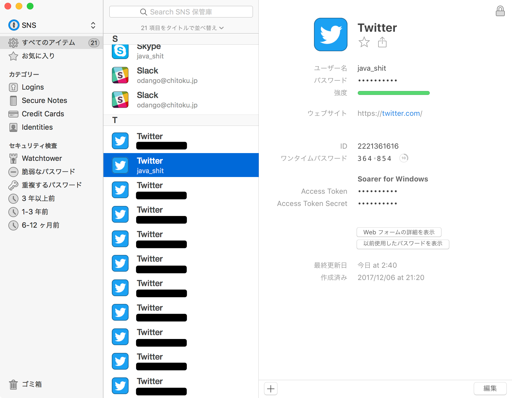
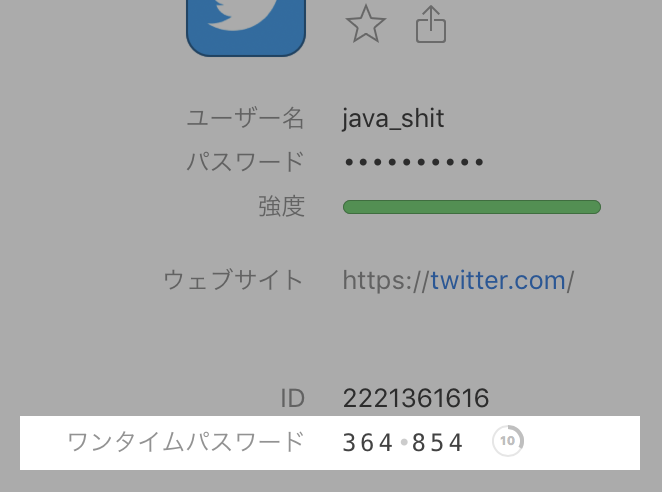
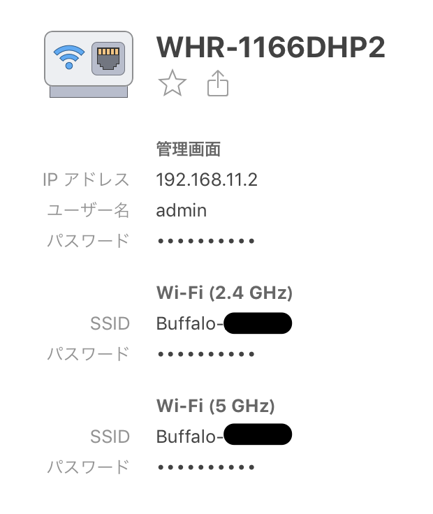
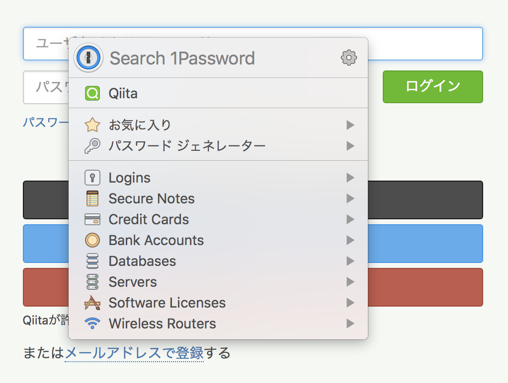
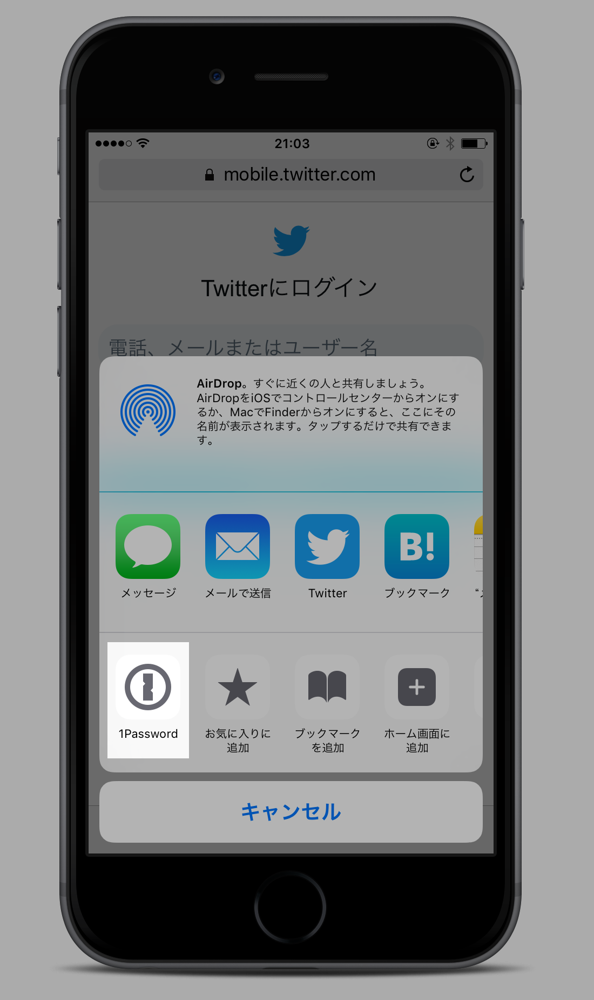

## うわっ……

<aside class="recommended" style="margin: 20px auto; width: 300px; height: 250px; background-color: #fff; color: #333; border: 1px solid #CACAC9;">

<strong>■おすすめ情報</strong>

<h6 style="margin: 8px 0 5px; font-size: 32px; line-height: 1.3; padding: 0 8px; white-space: nowrap;">うわっ…私のPW、 
危なすぎ…？</h6>

無料５分で、<strong style="color: #da7f3f;">自動生成</strong>や、 
<strong style="color: #da7f3f;">重複パスワード</strong>が分かる 
「パスワード管理ソフト」。 
使った人は<strong style="color: #da7f3f;">100万人</strong>を突破！ 
結果もすぐ分かると大人気だ。 
CHECK! 
&gt;&gt;あなたの適性PWは？

</aside>

<!-- more -->

## 1Password

これまですべてのパスワードを使いまわしてきたわたしですが、パスワードが全部違うほうがたぶんカッコ良いので 1Password を使い始めました。
重複するパスワード 117 項目という表示には思案に暮れるばかりでしたが、登録したのは真夜中なので日も暮れていて大丈夫。
朝までかけてすべて変更しました。

macOS 版と iOS 版をインストールしてみましたが完全に予想より遥かによくできていて恋に落ちました。
前回恋に落ちたソフトウェアは Vim だったので数年ぶりです。

## 基本機能

保存したいパスワードごとに保管庫（Vault）を作成し、使うときは検索したりリストから絞り込んだりして探し出せます。
\[ウェブサイト\] の項に URL を入れておくとブラウザーから呼び出すときに一覧に出てくるほか、1Password アプリ自体からブラウザーで URL を開いて自動でユーザー名とパスワードを入れてログインしてくれる機能があって便利です。

またログイン情報では通常のユーザー名とパスワードのほかにも、Google Authenticator などでおなじみの**ワンタイムパスワード**を発行する機能がついています。
PC でログインするときに 1Password アプリがクリップボードにワンタイムパスワードをコピーしてくれるのでスマートフォンを取り出す必要がなくなりました。
求めているセキュリティーのレベルが**二要素認証**（Two-factor Authentication）ではなく**二段階認証**（Two-step Verification）の場合はこれで十分ですね。

## 保存できる情報

1Password はパスワード管理ツールでこそありますが、大事な情報を暗号化して保存するための場所でもあります。
データの登録画面では Web サイトのパスワードを含め、次のように様々な情報を保存できるようになっています（以下はその一部）。

- Web サイトのユーザー名とパスワード
- テキスト
- クレジットカード
- 銀行口座
- データベースの接続情報
- Eメールの接続情報
- サーバーの接続情報
- ソフトウェアのライセンス情報
- Wi-Fi ルーターの接続情報

コピペしたいけれども紙に書いておくと失くしそうなデータを入れておくと便利です。
わたしは Wi-Fi ルーターの情報や Parallels Desktop のプロダクトキーなども入れてみました。

## Chrome 拡張機能

↑Qii○a にログインしている様子です。二段階認証のコードはクリップボードにコピーされます。

## iOS アプリ

iOS の Safari からは共有エクステンションを使ってログインできます。
Touch ID で 1Password の認証ができるのが便利です。

↑共有メニューから Tw○tter にログインしている様子です。二段階認証のコードはクリップボードにコピーされます。

## 愚痴

以下、1Password アプリのパスワードジェネレーターで 16 文字のパスワードを生成しまくっていたときに気づいた愚痴シリーズです。

### パスワード入力欄に最大文字数を設定するな

パスワードは人間が記憶するものではないわけですが、設定で入力欄に新しいパスワードを貼り付けるときに最大文字数が設定されていてもユーザーはそれに気がつくことができません。
●●●●●●●●●● と表示される●の数を数えて何文字入ったか確認するのは至難の業ですね。
パスワード入力欄に maxlength を設定するのではなく、最大長を超えていたらエラー表示をするような実装のほうが望ましいといえます。

パスワードに最大長があるのは仕方がないので、せめてブラウザーで最大長が表示されてくれると嬉しいです。
こういう拡張機能があっても良いですね。いつか書きたい。

### パスワード入力欄を貼り付け禁止に設定するな

パスワードは人間が記憶するものではないですが、（ｒｙ

Chrome の DevTools を使用して input 要素をインスペクターで表示させ、Event Listeners タブで paste イベントを削除すると回避できます。
こういう拡張機能があっても良いですね。いつか書きたい。

### パスワード変更時にメールを経由させることがあるのはなぜ？

なぜなんでしょう？

## まとめ

いざパスワードを管理するようになってみるとパスワードの重複が良くなかったことに気づけました。
とはいえこうして管理するものも少ないに越したことはないので、Twitter 連携のようなシングルサインオンがもっと普及してほしいですね。

## 参考

二段階認証: [TOTP support comes to 1Password | 1Password](https://blog.1password.com/totp-for-1password-users/)（英語）  
イラスト: [口を抑えてショックを受けている女性のイラスト | かわいいフリー素材集 いらすとや](https://www.irasutoya.com/2014/11/blog-post_317.html)
