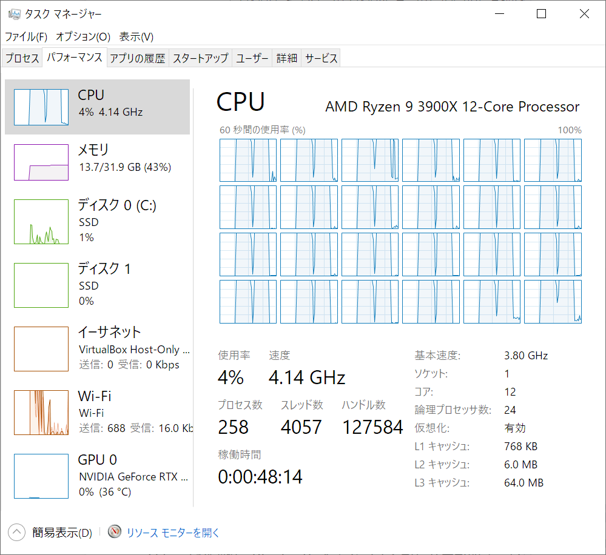
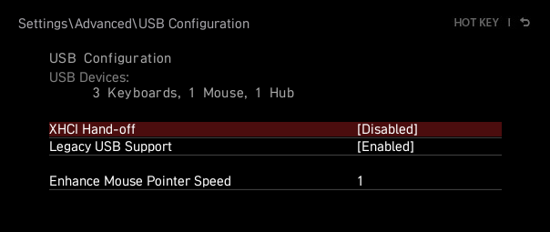
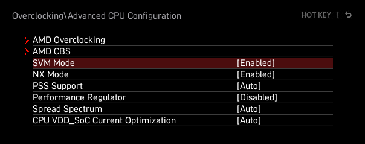
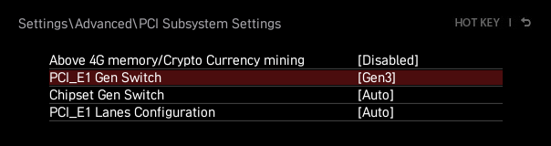
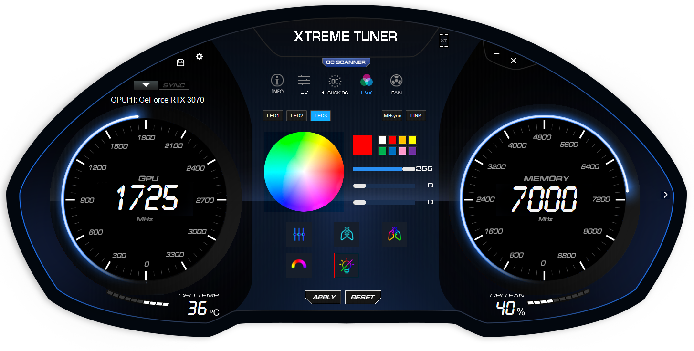
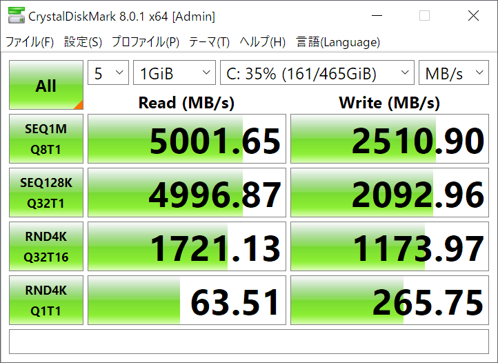
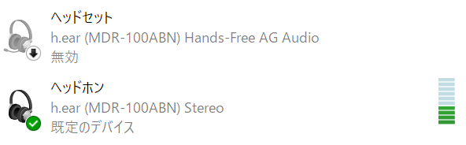

2016 年から愛用していた iMac が性能的に限界を迎えたのを機に、このたび自作 PC デビューを果たしました。
使っていた iMac は Fusion Drive 採用の HDD 搭載機で、5 年という期間は頑張ってくれた方です。

今回は予算 20 万円で、最低 5 年は戦ってくれることを期待したいマシンを以下の構成で組みました。  
構成は [@gaogao\_9](https://twitter.com/gaogao_9) にお願いしたら良い感じに考えてくれました。  
OS は Windows 10 Home パッケージ版の流用なので予算として考慮していません。

+----------+----------------------------+---------------------------------+---------------------------------------------------------------+
|          | 規格・型番等                                                 | <p style="text-align: right;">購入価格</p>                    |
+----------+----------------------------+---------------------------------+---------------------------------------------------------------+
| CPU      | AMD Ryzen 9 3900X[^1]                                        | <p style="text-align: right;">¥48,000</p>                     |
+----------+----------------------------+---------------------------------+---------------------------------------------------------------+
| M/B      | MSI B550 M/B               | MPG B550I GAMING EDGE WIFI[^2]  | <p style="text-align: right;">¥18,678</p>                     |
+----------+----------------------------+---------------------------------+---------------------------------------------------------------+
| GPU      | NVIDIA GeForce RTX 3070    | 玄人志向 GG-RTX3070-E8GB/TP[^3] | <p style="text-align: right;">¥65,544</p>                     |
+----------+----------------------------+---------------------------------+---------------------------------------------------------------+
| 電源     | SUPER FLOWER LEADEX III GOLD 850W[^4]                        | <p style="text-align: right;">¥14,828</p>                     |
+----------+----------------------------+---------------------------------+---------------------------------------------------------------+
| RAM      | DDR-3200 16GB×2            | ADATA AD4U3200716G22-D[^5]      | <p style="text-align: right;">¥12,827</p>                     |
+----------+----------------------------+---------------------------------+---------------------------------------------------------------+
| SSD      | NVMe PCIe Gen 4 SSD 500 GB | CFD 販売 CSSD-M2B5GPG3VND[^6]   | <p style="text-align: right;">¥10,480</p>                     |
+----------+----------------------------+---------------------------------+---------------------------------------------------------------+
| クーラー | SCYTHE 虎徹 MarkⅡ[^7]                                        | <p style="text-align: right;">¥3,828</p>                      |
+----------+----------------------------+---------------------------------+---------------------------------------------------------------+
| ケース   | Mini-ITX                   | SilverStone SUGO 15[^8]         | <p style="text-align: right;">¥23,999</p>                     |
+----------+----------------------------+---------------------------------+---------------------------------------------------------------+
| **合計**                                                                | <p style="text-align: right; font-weight: bold;">¥198,184</p> |
+----------+----------------------------+---------------------------------+---------------------------------------------------------------+

価格は 2020/12/28 時点のもの。年末に価格.com とにらめっこしながらポチポチしていました。

<!-- more -->

完成した様子。マザーボードの I/O パネルが黒基調でケースとマッチしていておしゃれだと思っています。
せっかくなのでこの PC の大まかな使用感と遭遇したトラブルの話をしておきます。

<twitter-tweet id="1347928054555791360"></twitter-tweet>

## CPU

当初は 12 コア 24 スレッドを使い切るようなタスクは想定していませんでしたが、Visual Studio でソフトウェアをビルドするときにはすべてのスレッドを利用して分散処理されていたので効果がありそうです。



## M/B

### USB 2.0 ポートの問題

このマザーボードの I/O パネルには USB 2.0 のポートが 2 つ搭載されていますが、USB 3.2 対応の USB 切替器をこのポートに接続した際に、USB 切替器に接続されたキーボードからの入力への応答速度が極端に低下するというトラブルがありました。

USB 切替器の問題なのかマザーボードの問題なのかは切り分けることができませんでしたが、USB 3.2 ポートに接続した場合は特に問題が発生することはありませんでした。

### スリープ復帰の問題

スリープ復帰後に Bluetooth デバイスや USB デバイスが Windows で機能しなくなるトラブルもありました。
これについては以下の操作で解消しました。

- Windows のデバイス マネージャーで設定を変更する
  1. ［設定］アプリを開く
  1. ［システム］をクリックする
  1. ［詳細情報］をクリックする
  1. ［デバイス マネージャー］をクリックする
  1. ［表示(V)］→［デバイス (接続別)(V)］をクリックする
  1. ［USB ルート ハブ (USB 3.0)］を右クリックして［プロパティ(R)］をクリックする
  1. ［電源の管理］タブをクリックする
  1. ［電力の節約のために、コンピューターでこのデバイスの電源をオフにできるようにする(A)］を外す
  1. ［OK］をクリックする
- Windows の電源オプションで設定を変更する
  1. ［設定］アプリを開く
  1. ［システム］をクリックする
  1. ［電源とスリープ］をクリックする
  1. ［電源の追加設定］をクリックする
  1. アクティブなプランの［プラン設定の変更］をクリックする
  1. ［詳細な電源設定の変更(C)］をクリックする
  1. ［スリープ］をダブルクリックする
  1. ［ハイブリッド スリープを許可する］をダブルクリックする
  1. ［設定］を［オフ］に変更する
  1. ［USB 設定］をダブルクリックする
  1. ［USB のセレクティブ サスペンドの設定］をダブルクリックする
  1. ［設定］を［無効］に変更する
  1. ［OK］をクリックする
- MSI Super Charger をアンインストールする
  - スリープ時などに USB ポートが充電モードに移行するようです（詳細不明）
- BIOS アップデートを実施する
  - [MSI Dragon Center](https://www.msi.com/Landing/dragon-center-download/nb) からであれば USB メモリーを使わずに BIOS をアップデートできます
- BIOS 画面で XHCI Hand-off を無効化する



### 電源プランの問題

コントロール パネルで電源プランを変更しても、スリープ復帰などのたびに電源プランが勝手に変わる問題が起きました。
これは Windows のイベント ビューアーを確認することでどのプロセスが電源プランを変更しているか確認できます。

1. イベント ビューアーを開く
1. ［Windows ログ］をダブルクリックする
1. ［システム］をクリックする
1. ［レベル］が「情報」で［ソース］が「UserModePowerService」のイベントをクリックする

今回は以下のように MSI Dragon Center が変更しているようだったので Windows 起動時に常駐しない設定としておきました。

```
プロセス C:\Program Files (x86)\MSI\One Dragon Center\MSI.CentralServer.exe (プロセス ID:10788) がポリシー スキーマを {38156909-5918-4777-864e-fbf99c75df8b} から {38156909-5918-4777-864e-fbf99c75df8b} にリセットします
```

以下の「電源プランを各アカウントに強制適用する」の手順で、電源プランを固定することもできます。

- [Windowsスマートチューニング(22) Vista編: 「電源プラン」をスマートに管理する | マイナビニュース](https://news.mynavi.jp/article/windows-22/)

### AMD-V

なぜオーバークロックの下に設定があるのか分かりませんが、仮想マシン利用のため有効化しておきます。



## GPU

### PCIe 4.0 の問題

今回のマザーボードは AMD B550 チップセットで PCIe Gen 4 に対応しています。
M.2 SSD や GPU が PCIe Gen 4 に対応している場合はデフォルトで Gen 4 が選択されますが、これが悲劇を生みました。


RTX 3070 を PCIe Gen 4 で接続している状態でグラフィックドライバーを有効にすると「強制的にグラフィック ドライバーを再インストールする」という通知が複数回表示され、そのたびに画面全体が数秒程度の暗転を繰り返します。

類似の問題は複数報告されており、いずれも PCIe Gen 3 で接続すると解決したように書かれています。
今回も BIOS 画面から `PCI_E1` を `Gen3` に設定することで正常に動作させることはできました。  
（なおこの設定は `M2_1` ならびに `M2_2` スロットに接続された SSD などには影響しません）



- [PSA if you get "Force to reinstall graphics driver" on a 3xxx card : nvidia](https://www.reddit.com/r/nvidia/comments/k622de/psa_if_you_get_force_to_reinstall_graphics_driver/)
- ["Force to reinstall graphics driver" PCIe Gen 4 bug : gigabyte](https://www.reddit.com/r/gigabyte/comments/kgfdte/force_to_reinstall_graphics_driver_pcie_gen_4_bug/)

ライザーケーブルを使用しているわけでもないのに初っ端から不安定なのはイマイチな気がしますが、PCIe Gen 4 で接続したからといって特にパフォーマンスが改善するわけでもないので良しとしておきます。

### Google Chrome の問題

Google Chrome で YouTube の動画を再生した際に動画がカクつくトラブルが頻繁に発生していました。  
Chrome の設定で［ハードウェア アクセラレーションが使用可能な場合は使用する］を無効化すると CPU でレンダリングされるため動画再生には支障をきたさなくなりますが、一方で CPU レンダリングの場合は Web サイトのアニメーションでカクつきが発生する場面がありました。

これは以下のように Windows の設定を変更することで、Chrome のハードウェアアクセラレーションが有効の状態でも問題なくなりました。

1. ［設定］アプリを開く
1. ［システム］をクリックする
1. ［ディスプレイ］をクリックする
1. ［グラフィックの設定］をクリックする
1. ［ハードウェア アクセラレータによる GPU スケジューリング］を［オン］にする
1. PC を再起動する

なお、Chrome のウィンドウをドラッグした際にカクつくという別の問題がどうしても解決できなかったので結局 Firefox に乗り換えました。
これよりも性能の低い PC では全くカクつかないのにどうして……。

### RGB LED まぶしすぎ問題

この GPU の出荷時設定では RGB LED が常時 8 色に変わりながら点灯しますが、明るい部屋で使用していても鬱陶しいです。
玄人志向のモデルの場合は [Xtreme Tuner Plus](https://www.galax.com/jp/xtreme-tuner-plus-rtx) というソフトウェアをインストールすることで LED を消灯に変更することができます。
設定は本体側に保存されるため常駐は必要ありませんでした。



本製品の LED は 12 V 4-pin で、このソフトウェアを利用してもファンごとの個別の色設定はできません。

## RAM

AMD Ryzen 9 3900X のメモリーは定格 3200 MHz 動作のため DDR4-3200 のメモリーを使用、安定して動作しています。

## SSD

PCIe Gen 4 SSD にしても体感速度に影響はないと言われてはいますが、ロマン仕様ということで搭載したのでベンチマークをとっておきました。
ベンチマークではきちんとロマンある速度が観測できたので満足。



（ランダムアクセスのほうが体感速度に効いてくるため、巨大なファイルのコピーを繰り返すといったユースケースでしか差を感じることは難しいと思われます）

ロマン抜きでもコストパフォーマンスが比較的良いのでオススメしておきますが、ストレージとしての信頼性は一ヶ月程度しか経っていないため評価できません。

## クーラー

虎徹 MarkⅡ に付属のファンは静音性が高く、性能的にもケースファンと組み合わせれば空冷で十分でした。

## ケース

全面アルミニウム製のパネルで覆われた Mini-ITX のキューブケースですが、317 mm ある玄人志向の RTX 3070（三連ファン）が問題なく収納できて概ね満足しています。

### USB Type-C

フロントに USB Type-C ポートがあります。このケースを選んだ大きな理由の一つで、便利に活用しています。

### 電源の奥行き

Web サイトの製品紹介ページでは電源は 150 mm までとなっていますが、ページ最下部でダウンロードできるマニュアルでは最大奥行き 160 mm（推奨値 150 mm）と書かれており、やや分かりづらい記載でした。
実際にこの PC には 150x160x86 mm の ATX 電源を使用しましたが、特に問題なく搭載することができました。

### 冷却

上記の構成は空冷で使用していますが、GPU 使用率が 100% になる状態で数時間使用し続けての温度上昇は最大 70 ℃ 程度です。
ケースに付属のファンはお世辞にも静音性が高いとは言えませんが、このファンを止めるとアイドル時でも不安定になりました。
この CPU をセミファンレス運用するのは厳しいようです。

### 作業性

前後を除く四枚のパネルを外して作業することが可能なので Mini-ITX ケースとしては作業しやすい部類でした。
ドライバーを使用しなくてもこれらのパネルは外すことができるので簡単な掃除もできます。

### 塗装

パネルに傷がつくと塗装が剝げてアルミニウムの部分が露出し、なんだか残念な気持ちになります。

## Windows

### Bluetooth ヘッドホンのプロファイル

Bluetooth ヘッドホンを Windows に接続した直後の数秒程度のみ HFP で認識され、接続する度に一時的に音質が大幅に悪化する現象もありました。
USB マイクを使用しているため Bluetooth ヘッドフォンのマイクは必要としておらず、Hands-Free AG Audio（HFP の Audio Gateway）を無効化して回避しました。



1. ［設定］アプリを開く
1. ［システム］をクリックする
1. ［サウンド］をクリックする
1. ［サウンド コントロール パネル］をクリックする
1. 「Stereo」と表記されていない Bluetooth ヘッドセットを右クリックする
1. ［無効化］をクリックする
1. ［OK］をクリックする

A2DP の方が既定のデバイスとして設定されていても、有効である限りはまず HFP で接続されてしまう仕様のようです。

## 雑感

今まではメーカー PC や Mac しか使ってこなかったですが自作 PC も楽しみながら組み立てられました。
GPU の相性問題のようなトラブルでは頭を抱えましたが、正常に動作するようになると愛着も湧くものです。
今後はプライベートで Mac を卒業、Windows でゲームをしつつ Linux で開発や実験をしていきます。
仕事では引き続き Mac をメインで使うので頭はバグりそうですが、使える OS は多いほうが楽しい気もします。

## 脚注

[^1]: [AMD Ryzen 9 3900X](https://www.amd.com/en/product/8436)
[^2]: [MPG B550I GAMING EDGE WIFI](https://jp.msi.com/Motherboard/MPG-B550I-GAMING-EDGE-WIFI)
[^3]: [GG-RTX3070-E8GB/TP](https://web.archive.org/web/20210119183245/https://www.kuroutoshikou.com/gaming/product/graphics_bord/nvidia/gg-rtx3070-e8gb_tp/)（Wayback Machine）
[^4]: [SUPER FLOWER LEADEX III GOLD 850W](https://www.super-flower.com.tw/product-data.php?productID=100&lang=en)
[^5]: [ADATA AD4U3200716G22-D](https://www.adata.com/jp/consumer/category/computer-memory/655/)
[^6]: [CSSD-M2B5GPG3VND](https://www.cfd.co.jp/biz/product/detail/cssd-m2b5gpg3vnd.html)
[^7]: [SCYTHE 虎徹 MarkⅡ](https://web.archive.org/web/20210116182355/https://www.scythe.co.jp/product/cpu-cooler/scktt-2000)（Wayback Machine）
[^8]: [SilverStone SUGO 15](https://www.silverstonetek.com/jp/product/info/computer-chassis/SUGO15/)
