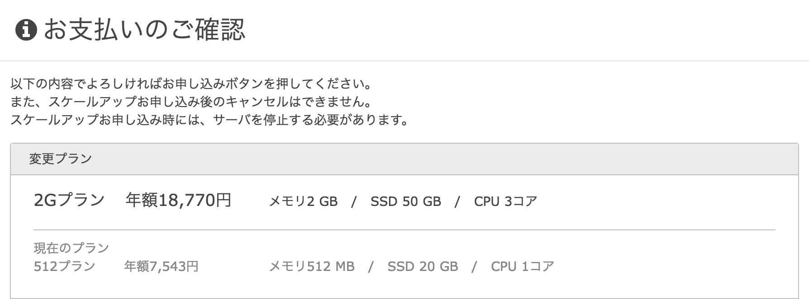

SSD の容量とかスペックが足りなくなってきたのでスケールアップしてみました。
`/home` に 30 GB くらいあてられたので一生大丈夫（適当）。

## 手順

1. コントロールパネルで涙を流す

1. [CentOS7.2 | さくらの VPS ドキュメント](https://manual.sakura.ad.jp/vps/server/disk-expansion/centos7.html) を読む
1. 祈りながら再起動する

## メモ

`fdisk` はパーティションテーブルが GPT だと使えないので代わりに `gdisk` を使う。
