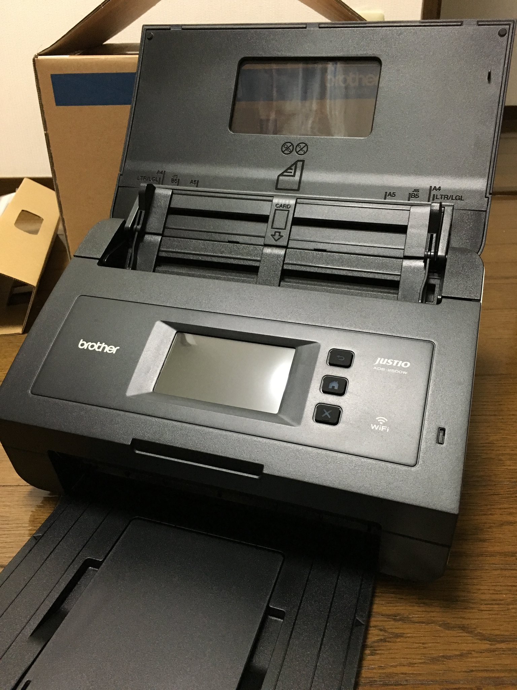
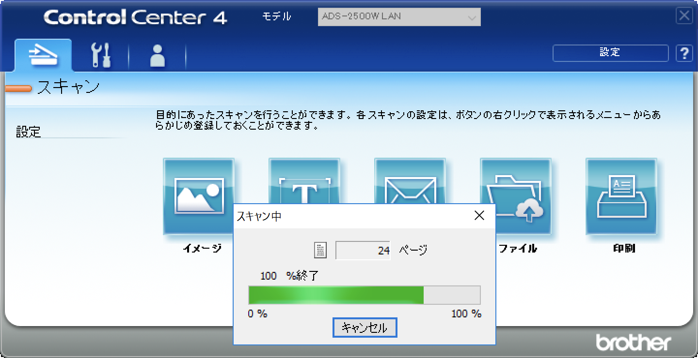

ふと思い立って Brother が出している ADS-2500W というドキュメント スキャナーを買ってみました。

今までは文書化の用途にフタ付きのスキャナー（フラットヘッド タイプ）を使用していましたが、2 億枚くらいスキャンしてバシバシ捨てていくには腕力が足りなかったので、筋トレの代わりに連続スキャンできるものを選んでみた感じです。

それまで購入候補としては次の機種を考えていました。

- [ScanSnap S1300i](https://www.pfu.ricoh.com/scansnap/products/s1300i/index.html)（FUJITSU）
- [ADS-1500W](https://www.brother.co.jp/product/scanner/ads1500w/index.aspx)（Brother）
- [ADS-2500W](https://www.brother.co.jp/product/scanner/ads2500w/index.aspx)（Brother）

いずれも実勢価格が 2 万円前後のシートフィーダがついている製品です。Canon の imageFormula は 4 万円台だったので少し胸が苦しくなり断念。

<!-- more -->

ででーん。意外と大きい。

見た目はチープでもなく高級すぎる感じでもなくといった感じです。
A4 とそれよりちょっと大きい書類を呑めます。
連続読み取りの枚数が 50 枚であることに加えて、Wi-Fi を通してスキャンしたデータを直接 PC に保存できるのもアツいです。
電源コードを繋いでサクっとスキャンできるので、急にスキャンしないと死ぬ病気になっても死なずに済みます。

## ControlCenter

ControlCenter というアプリケーションから Wi-Fi によって同一のネットワーク上に存在しているスキャナーへの操作が行うことができます。
スキャナーからスキャンボタンを押して PC にデータを保存することはできますが、設定変更は PC からのみ行うことができる仕様のようです。

二週間ほど使ってみましたがスキャナー本体と PC を直接繋ぐことなく、書類を連続で取り込むことができるのは実際に想像していたよりも便利で、お部屋がスッキリして彼女もできました。

普段は iMac で遊んでいるので当初は ControlCenter の OS X 版を El Capitan にインストールして使ってみましたが、スキャンするたびにめちゃくちゃ落ちまくって悲しくなったので捨てました。
仮想の Windows 上でうまく動いているので良しとしましょう。Windows 版だと落ちません。

## 補正機能

ADS-2500W にはスキャンデータに対する補正機能がいくつか搭載されています。

- 傾き補正
- 重送検知
- 原稿向き自動判別
- 白紙除去
- 裏写り除去/地色除去

ADF（オートドキュメントフィーダー: 自動紙送り装置）は書類を結構めちゃくちゃに呑み込むので、取り込み完了後の自動傾き補正は必須です。
残念ながらこれでも完全に真っ直ぐにはならないので神経質な人は修正しないとダメかもしれません。

重送検知というのは 2 枚以上の書類を同時に紙送りしてしまった際に警告してくれる機能で、かなり正しく検知してくれています。
紙をよくさばいてから枚数を減らし、騙しだまし読み込んでいくとお世話にならずに済みます。

残りの 3 つの機能、原稿向き自動判別と白紙除去、裏写り除去はほぼ役に立ちません。
PDF にしてから編集できるツールがあると便利かなって感じです。

さて、お部屋がきれいになったのでめでたしめでたしです（完）
