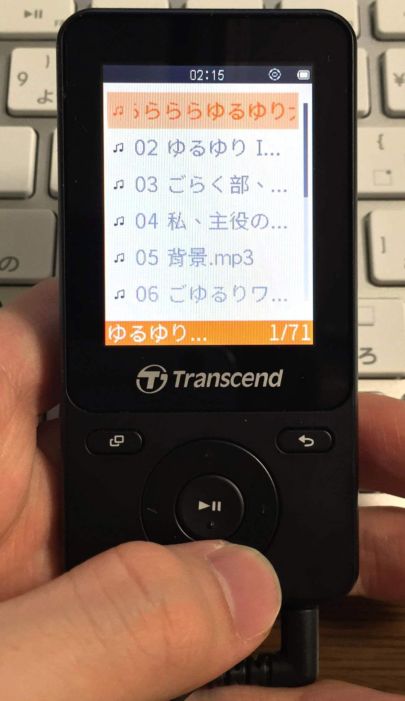

Amazon のサイバーマンデーに手を滑らせて Transcend の MP3 プレーヤーを買ってみました。
使っているスマートフォンのストレージが 16 GB しかなく、音楽に 5 GB も持っていかれるのがつらかったのでポチったわけです。

## 気になったこと

Transcend といえばメモリのような PC 部品がメインの台湾のメーカーですよね。

&gt;&gt;&gt; 中華フォント &lt;&lt;&lt;

まあそんな気はしていました（？）

わたしはフォントおじさんではないですが、どうやら源ノ角ゴシックの中国語（繁体字）がプリインストールされているようです。
そして MP710 はフォントを変更できるようにはなっておらず、また対応手段も見当たらなかったので言語設定を英語にしてお茶を濁すことに。快適。

<!-- more -->

## 転送とか使い勝手とか

今までのように、半強制的にバックアップと同期を行う上に Windows 版の動作が異常に遅い iTunes というソフトウェアを使う必要がなくなりました。
マニュアルのどこにも書かれていませんが MP710 はフォルダ内でファイル/フォルダが登録された順に表示されるようになっているようです。
エクスプローラーで適当にフォルダを作ったあと並べたい順にドラッグ・アンド・ドロップしていく簡単なおしごとで綺麗に並べられました。

仕様には MP3 に対応していると書いてありました。っていうかそれしか書いてありませんでした。そういうの仕様って言わないよね。
音が出ていれば全部同じだと思っているぼくの耳によれば普通のプレーヤーです。付属のイヤホンは使っていないのでここでは未評価。

再生画面には ID3v2 なタグとともにアルバムアートが表示され、この表示域が 240x240 のようです。
このサイズ以下にアルバムアートを縮小しておかないと、内蔵の品質の良くない縮小ソフトウェアにより汚く表示されます（逆にこれをやっておくと結構綺麗）

## 歌詞表示について

おまけとして歌詞表示機能がついています。タイムタグ付きの歌詞テキストを同じフォルダに保存するタイプのものですが、全く使いものになりませんでした。
なんか気まぐれで前後に 0.5 秒くらいズレるんですよね。でもタイムタグ付きの歌詞を作成している間に歌詞を覚えてしまったので要らなくなりました♡

## 電池持ちはめっちゃ良かった

公称 42 時間という化け物スペックは割と事実に近いような気がします。
1 日に 3 時間くらいしか使っていないのでよくわかりませんが、2～3 日に 1 度適当に充電しておくだけで特に困らず使えました。

## というわけで

音楽プレーヤーというものを使ったことがなかったぼくですが、何も考えずに手袋着けたまま操作でき、落としても壊れる心配がほぼないデバイスとしては良い買い物でした。おしまい。
