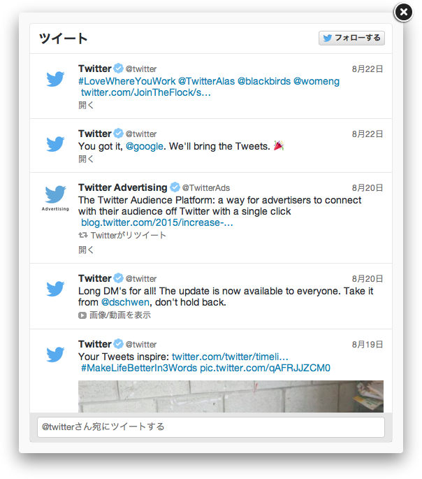
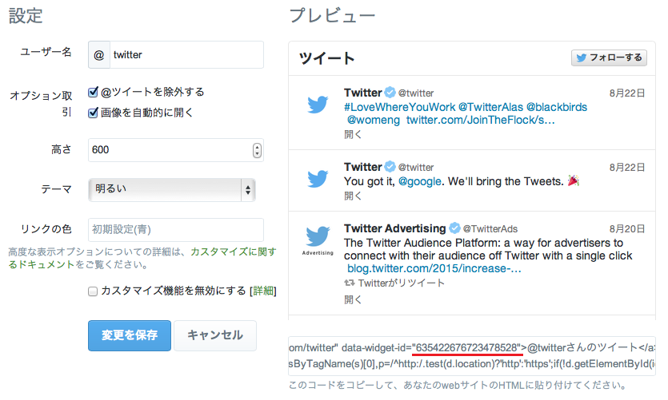

Fancybox とは画像やメディアなどを拡大表示するための jQuery プラグインですが、今回はその中に Twitter の埋め込みタイムラインを表示させてみます。
実際に今回のスクリプトを使用すると以下のようになります。



<!-- more -->

## 設置方法

1. jQuery と Fancybox を head 要素内など、スクリプトの設置場所より前に読み込みます（1 ページにつき 1 回）  
Fancybox は [Fancybox | Fancyapps UI - Robust JavaScript UI Component Library](https://fancyapps.com/fancybox/) からダウンロードして適切なディレクトリに配置してください。

```html
<!-- CSS -->
<link rel="stylesheet" href="/fancybox/source/jquery.fancybox.css?v=2.1.5">
<!-- JavaScript -->
<script src="https://code.jquery.com/jquery-1.11.1.min.js"></script>
<script src="https://platform.twitter.com/widgets.js"></script>
<script src="/fancybox/source/jquery.fancybox.pack.js?v=2.1.5"></script>
```

2. Twitter の埋め込みタイムラインを作成し、ウィジェット ID を取得します。
    1. Twitter にログインして、[Twitter / 設定](https://twitter.com/settings/widgets) を開きます。
    2. [新規作成] でウィジェットを作成したあと、以下の図の場所にある ID をメモします。
    
3. 設置したい場所に次のコードを挿入します。  
`(任意のID)` には半角英数字で適当な ID を指定します。  
`(ウィジェットID)` にはさきほど取得した ID を指定します。

```html
<a href="#(任意のID)" data-width="520" data-height="600" class="twitter-timeline-fancybox-link">ツイートを表示</a>
<div id="(任意のID)" data-id="(ウィジェットID)" data-lang="ja" style="display: none"></div>
```

4. ページの最後に 1 回のみ、次のスクリプトを挿入します。

```html
<script>
  $(function () {
      $(".twitter-timeline-fancybox-link").each(function () {
          var $this = $(this);
          var href = $this.attr("href");
          var $target = $(href.slice(href.indexOf("#")));
          var options = $this.data();
          options.type = "inline";
          options.autoSize = false;
          options.afterShow = function () {
              $.fancybox.showLoading();
              $target.empty();
              var options = $target.data();
              if (options.height) {
                  options.height = Math.min(options.height, this.inner.height());
              }
              window.twttr.widgets.createTimeline(options.id, $target[0], options).then(function (elm) {
                  $.fancybox.hideLoading();
              });
          };
          $this.fancybox(options);
      });
  });
</script>
```

5. 設置完了です。

## カスタマイズ

### Fancybox のカスタマイズ

表示ボタン（a 要素）の data-\* 属性を使い、[Documentation](https://fancyapps.com/fancybox/#docs) に記載されているオプションでカスタマイズできます。  
例：`fitToView` → `data-fit-to-view`

```html
<a href="#twitter-timeline-widget"
   class="twitter-timeline-fancybox-link"
   data-width="400"
   data-height="800"
   data-open-effect="elastic"
   data-close-effect="elastic">
  ツイートを表示</a>
```

### Twitter のカスタマイズ

埋め込みタイムライン（div 要素）の data-\* 属性を使い、[Scripting: Factory Functions | Twitter Developer](https://developer.twitter.com/en/docs/x-for-websites/javascript-api/guides/scripting-factory-functions) に記載されているオプションでカスタマイズできます。  
例：`showReplies` → `data-show-replies`

```html
<div id="twitter-timeline-widget" style="display: none"
     data-id="(任意のID)"
     data-lang="ja"
     data-chrome="nofooter noborders"
     data-show-replies="true">
</div>
```
