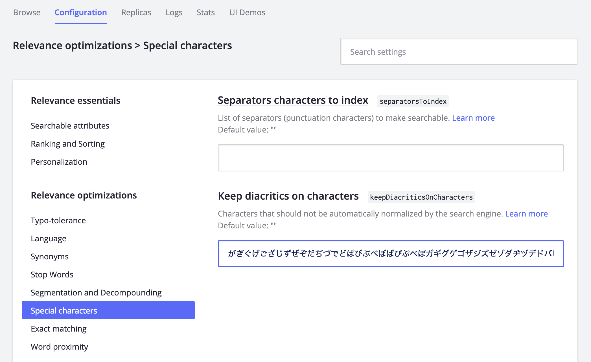
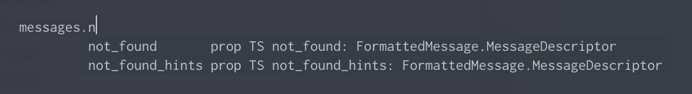

2019/02 まで WordPress で管理していた chitoku.jp ですがこの度 Gatsby に移行しました！

<twitter-tweet id="1097194006700675073"></twitter-tweet>

## TL;DR

1. Gatsby で TypeScript なら [gatsby-plugin-ts-loader](https://www.gatsbyjs.org/packages/gatsby-plugin-ts-loader/) + [tsconfig-paths-webpack-plugin](https://www.npmjs.com/package/tsconfig-paths-webpack-plugin)
2. Algolia で日本語の検索をするときは _Keep diacritics on characters_ に注意
3. [babel-plugin-react-intl-auto](https://www.npmjs.com/package/babel-plugin-react-intl-auto) に出した PR がマージされた[^1]
4. [gatsby-transformer-remark](https://www.gatsbyjs.org/packages/gatsby-transformer-remark/) に出した PR がマージされた[^2]
5. [remark-grid-tables](https://www.npmjs.com/package/remark-grid-tables) に出した PR がマージされた[^3]
6. Gatsby の IE サポートは半分嘘なので残り半分は自分でやる

## Gatsby とは

[Gatsby](https://www.gatsbyjs.org/) は React 製の静的サイトジェネレーターです。Markdown や画像、YAML、テキストファイルなどを透過的に扱うサーバーをローカルに建てて、それらを React のコンポーネントから GraphQL クエリーを通じて組み込めるという特徴があります。豊富なプラグインによって動作を拡張できるほか、細かいカスタマイズは自分でローカルにプラグインとして切り出して管理することができます。

コアの基本的に見える機能もプラグインとして切り出されており、ビルド時のフックに比較的柔軟に介入できます。たとえば Markdown をソースとすると、[gatsby-source-filesystem](https://www.gatsbyjs.org/packages/gatsby-source-filesystem/) がファイルを読み込んで [gatsby-transformer-remark](https://www.gatsbyjs.org/packages/gatsby-transformer-remark/) に処理を委譲し、さらに下位のプラグインが Markdown パーサーの処理をカスタマイズできます。今回は以下のようなプラグインを入れてみました。

<!-- more -->

- [gatsby-remark-attr](https://www.gatsbyjs.org/packages/gatsby-remark-attr/)
  - Markdown 内のリンクや画像などに HTML 属性の機能を追加するプラグイン（[remark-attr](https://www.npmjs.com/package/remark-attr)）
- [gatsby-remark-component](https://www.gatsbyjs.org/packages/gatsby-remark-component)
  - Markdown 内に書かれた `html¦<my-component />` を React のコンポーネントとして組み込むプラグイン（[rehype-react](https://www.npmjs.com/package/rehype-react)）
- [gatsby-remark-embed-gist](https://www.gatsbyjs.org/packages/gatsby-remark-embed-gist/)
  - Markdown 内の Gist の URL を Gist の埋め込みに展開するプラグイン
- [gatsby-remark-grid-tables](https://www.gatsbyjs.org/packages/gatsby-remark-grid-tables/)
  - Markdown 内にアスキーアートの要領で書かれた表組を `html¦<table>` に展開するプラグイン（[remark-grid-tables](https://www.npmjs.com/package/remark-grid-tables)）

静的サイトジェネレーターはこれ以外にも色々ありますが、開発が活発な上、プラグインを中心としたエコシステムが盛り上がっているので今回は WordPress からの移行先を Gatsby に決めました。

## Gatsby と TypeScript

静的型付けは最高なので Gatsby も TypeScript から使っていくことにしました。

Gatsby の TypeScript サポートについて調べてみると、まず [gatsby-plugin-typescript](https://www.gatsbyjs.org/packages/gatsby-plugin-typescript/) が出てきます。ドキュメントにもありますがこれは [babel-plugin-transform-typescript](https://babeljs.io/docs/en/babel-plugin-transform-typescript.html) によってソース内の型情報などを消去するトランスパイルを行うプラグインで、型チェックの類は別のプラグインで行う必要があるほか、Babel の性質上これはファイル単位で動作するためにモジュールの解決が TypeScript と異なるものになります。

TypeScript のコンパイラーで Gatsby のコンポーネントを利用したかったため今回は [gatsby-plugin-ts-loader](https://www.gatsbyjs.org/packages/gatsby-plugin-ts-loader/) というプラグインを利用しました。スターがほとんどついていないので悲しいですが、やっていることは [ts-loader](https://github.com/TypeStrong/ts-loader) を webpack のチェインに追加しているだけなのでおそらく大丈夫です。これを利用することで、[typescript](https://www.npmjs.com/package/typescript) によってコンパイルされます。

注意点として、[ts-loader](https://github.com/TypeStrong/ts-loader) のモジュール解決は既定では [typescript](https://www.npmjs.com/package/typescript) と異なり、エイリアスや `tsconfig.json` に書かれた `paths` フィールドが使用されません。今回は [tsconfig-paths-webpack-plugin](https://www.npmjs.com/package/tsconfig-paths-webpack-plugin) をインストールして `gatsby-node.js` に以下のような設定を追記して解決させました。

```javascript
const TsconfigPathsPlugin = require('tsconfig-paths-webpack-plugin')

exports.onCreateWebpackConfig = ({
  actions: {
    setWebpackConfig,
  },
}) => {
  setWebpackConfig({
    resolve: {
      plugins: [
        new TsconfigPathsPlugin(),
      ],
    },
  })
}
```

また現状では TypeScript が使えるのは webpack の守備範囲のみです。Gatsby のコアに対して型定義を追加するプルリクエスト[^4]が出てはいますが、そもそもどう導入するのかという部分で決定打がない状況です。

## Algolia

[Algolia](https://www.algolia.com/) はサーバーレス・アーキテクチャに最適な全文検索を提供している Functional SaaS です。クエリーを投げるだけで、予め Algolia に登録しておいたデータから検索結果を返してくれるスグレモノです。React 向けには [React InstantSearch](https://www.algolia.com/doc/guides/building-search-ui/what-is-instantsearch/react/) が提供されており、比較的簡単に Algolia によるインクリメンタル・サーチを導入することができます。（右上で試してみてください！！）

### 日本語圏で Algolia を使う際の注意

関連するドキュメント[^5]では日本語特有のことまでは書かれていませんが、Algolia の検索エンジンがデータを正規化する際のステップによって日本語圏のユーザーには少し頭の痛い問題が発生します。

> What do we mean by normalization
> - Switch all characters to lower case
> - Remove all diacritics (eg accents)
> - Remove punctuation within words (eg apostrophes)
> - Manage punctuation between words
> - Use word separators (such as spaces, but not only)
> - Transform traditional Chinese to modern

それは、上記の _Remove all diacritics (eg accents)_ が日本語の濁点・半濁点を対象としており、「ハハ」と「パパ」が区別なく検索される点です（雰囲気がハハパパ問題[^6]と似ていると思いました）。たとえば chitoku.jp の場合、既定の設定だと「ハック」と「バック」の検索結果が同一のものになってしまいます。

Algolia ではこの問題に対して個別で設定を変更するようになっています。日本語圏では Algolia のダッシュボードの [Indices] > [Configuration] > [Relevance optimizations] > [Special characters] > [Keep diacritics on characters] に以下のように濁点・半濁点の文字を書き並べると期待したように「ハック」と「バック」が区別され、検索/表示されるようになりました。

```
がぎぐげござじずぜぞだぢづでどばびぶべぼぱぴぷぺぽガギグゲゴザジズゼゾダヂヅデドバビブベボパピプペポ
```



この設定は変更した後にインデックスを完全に再生成する必要があるようです。

## 国際化対応

chitoku.jp は国際化対応する予定はありませんが、コンポーネントのソース内に日本語の文字列リテラルを書いていくのは管理しにくいため [react-intl](https://www.npmjs.com/package/react-intl) をメッセージのカタログとして使うことにしました。react-intl は `javascript¦defineMessages()` を使って `id` を手動で定義する必要があって面倒ですが、[babel-plugin-react-intl-auto](https://www.npmjs.com/package/babel-plugin-react-intl-auto) というパッケージがこれをうまく解決してくれました[^7]。

開発スタート時は babel-plugin-react-intl-auto が自動生成する `javascript¦defineMessages()` の関数シグネチャーが TypeScript の型定義と合っていないために TypeScript プロジェクトで導入できませんでしたが、型定義を取り込んでもらえたので[^1]良い感じに使えるようになりました[^8]。[@babel/plugin-transform-typescript](https://www.npmjs.com/package/@babel/plugin-transform-typescript) を Babel の設定に追加することで [extract-react-intl-messages](https://www.npmjs.com/package/extract-react-intl-messages) と併用し `messages.ts` からメッセージ用の翻訳ファイルを生成することも可能です！

```javascript
import { defineMessages } from 'react-intl'

export default defineMessages({
  title: '検索',
  title_text: '検索結果: {text}',
  how_to_search: '検索したいキーワードを入力してください。',
  not_found: '{text} を含む記事が見つかりませんでした。',
  not_found_hints: '記事のタイトル、カテゴリー、タグ、本文冒頭のみが検索の対象です。',
})
```

TypeScript なので `typescript¦keyof` で補完が表示されるのも地味に嬉しいところ。



## gatsby-transformer-remark

[gatsby-transformer-remark](https://www.gatsbyjs.org/packages/gatsby-transformer-remark/) の GraphQL API には `excerpt` と呼ばれるフィールドが定義されており、Markdown 記事の冒頭部分の抜粋を取得することができるようになっています。たとえば、次のようなクエリーを実行すると `excerpt` に記事冒頭の文字列が返ってきます。

```graphql
query {
  allMarkdownRemark(limit: 1) {
    edges {
      node {
        # HTML: 冒頭部分の抜粋 (GraphQLString)
        excerpt
        # AST: 冒頭部分の抜粋 (GraphQLJSON)
        # ↓これが実装されていなかった……
        excerptAst
        # HTML (GraphQLString)
        html
        # AST (GraphQLJSON)
        htmlAst
      }
    }
  }
}
```

chitoku.jp では gatsby-remark-component というプラグインを使っているため文字列による抜粋では不都合で、`htmlAst` のように AST での抜粋が必要だったものの、従来は文字列型のフィールドしか実装されていませんでした。以前は `excerpt` フィールドを処理する部分に全ての抜粋処理が書かれていたためそれらをすべて剝がしたり、無駄にキャッシュ処理を弄ったせいでバグを出したり、となかなか大変でしたが [gatsby-transformer-remark@2.3.0](https://github.com/gatsbyjs/gatsby/blob/master/packages/gatsby-transformer-remark/CHANGELOG.md#230-2019-02-25) で取り込んでもらえました[^2]。

## remark-grid-tables (zmarkdown)

[remark-grid-tables](https://www.npmjs.com/package/remark-grid-tables) は下記のようにアスキーアート的な表現の表を `html¦<table>` に展開するプラグインです。

<div style="max-width: 500px; margin: 0 auto 30px;" class="monospace">

```
+--------------+------------------+--------------------+
| **ちとくのホームページ年表**                         |
+--------------+------------------+--------------------+
| **時期**     | **ホスト**       | **フレームワーク** |
+--------------+------------------+--------------------+
| 〜2014/02/27 | レンタルサーバー | VanillaJS 🤣       |
+--------------+------------------+                    |
| 〜2015/06/20 | VPS              |                    |
+--------------+                  +--------------------+
| 〜2019/02/18 |                  | WordPress          |
+--------------+                  +--------------------+
| 〜現在       |                  | Gatsby             |
+--------------+------------------+--------------------+
```

<div style="text-align: center;">
↓↓↓↓↓
</div>

+--------------+------------------+--------------------+
| **ちとくのホームページ年表**                         |
+--------------+------------------+--------------------+
| **時期**     | **ホスト**       | **フレームワーク** |
+--------------+------------------+--------------------+
| 〜2014/02/27 | レンタルサーバー | VanillaJS 🤣       |
+--------------+------------------+                    |
| 〜2015/06/20 | VPS              |                    |
+--------------+                  +--------------------+
| 〜2019/02/18 |                  | WordPress          |
+--------------+                  +--------------------+
| 〜現在       |                  | Gatsby             |
+--------------+------------------+--------------------+
</div>

表の中でセルの結合が入り組んでいる場合にそれらを HTML で表現するのは面倒ですし、表は Markdown の標準的な文法ではサポートされていないのでなかなか便利なプラグインです。このプラグインは chitoku.jp に組み込んだ当時は日本語や絵文字などの全角文字へのサポートがなく、正しい形で表を出力させるには「abcde」も「あいうえお」も同じ 5 文字と数えて次のように書く必要がありました。

<div style="max-width: 500px; margin: 0 auto 10px;" class="monospace">

```
+-------+
| abcde |
+-------+
| あいうえお |
+-------+
```
</div>

これだとエディター上でも表示が揃わないため日本語環境で使うのは厳しい状態だったので、全角文字対応のプルリクエスト[^3]を出したところ無事取り入れられ、今では表示幅基準で表が書けるようになっています。

コンソール上で表示される文字の幅には全角と半角の二種類があり、それらの表示や文字幅計算にはやや面倒な処理が必要になるという事実はなかなか東アジアの外では理解されにくいのかもしれません。わたしも右から左へ向かって書いていく言語の処理の常識を全く知らないので難しいですね……。結局、この対応をするためには以下の処理が必要でした。

### 文字幅の考慮

全半角は [@nxmix/is-full-width](https://www.npmjs.com/package/@nxmix/is-full-width) で判定できます。

### サロゲートペアの考慮

JavaScript で文字列を処理する際に `javascript¦for (let i = 0; i < str.length; ++i)` といったループを使用すると壊れる文字があります。

```javascript
'🐶'[0] // => "�"
```

サロゲートペアに対応している関数を使えば適切に分割できます。

```javascript
Array.from('🐶') // => ["🐶"]
```

### 書記素の考慮

対応がサロゲートペアのみの場合、JavaScript では家族離散の危機があります。

```javascript
Array.from('👨‍👨‍👧‍👦') // -> ["👨", "‍", "👨", "‍", "👧", "‍", "👦"]
```

[grapheme-splitter](https://www.npmjs.com/package/@naytev/grapheme-splitter) を使えばこれらは正しく扱えます。

```javascript
const splitter = new GraphemeSplitter()
splitter.splitGraphemes('👨‍👨‍👧‍👦') // -> ["👨‍👨‍👧‍👦"]
```

結果的にほとんどの計算処理を見直すことで修正できましたが絵文字ってやつはこれだから大変です……。

## Internet Explorer サポート

Gatsby は IE 9+ のサポートを謳っていますが[^9]、実態は普通の [@babel/preset-env](https://babeljs.io/docs/en/babel-preset-env) です。[core-js](https://www.npmjs.com/package/core-js) が面倒を見ない部分や Babel の方針[^10]によって Stage 4 未満の Proposal に該当するものは自分で polyfill を入れる必要があります。必要な polyfill を見定めながら `gatsby-browser.js` に下記のように書けばサポートできます。

```javascript
exports.onClientEntry = () => {
  require('core-js/fn/array/flat-map')
  require('core-js/fn/array/from')
  require('core-js/modules/es6.symbol')
  require('url-search-params-polyfill')
  require('whatwg-fetch')
}
```

## というわけで

Gatsby 以外の話がかなり長くなりましたが chitoku.jp の Gatsby 版ができるまでの長いお話でした。多くの便利なパッケージを知り、それらに貢献する良い機会になったので楽しく移行できました。おしまい。

## 脚注

[^1]: [chore(typescript): add TypeScript support by chitoku-k · Pull Request #54 · akameco/babel-plugin-react-intl-auto · GitHub](https://github.com/akameco/babel-plugin-react-intl-auto/pull/54)
[^2]: [feat(gatsby-transformer-remark): add excerptAst to be exported as a GraphQL field by chitoku-k · Pull Request #11237 · gatsbyjs/gatsby](https://github.com/gatsbyjs/gatsby/pull/11237)
[^3]: [fix(remark-grid-tables): support fullwidth tables by chitoku-k · Pull Request #312 · zestedesavoir/zmarkdown · GitHub](https://github.com/zestedesavoir/zmarkdown/pull/312)
[^4]: [TypeScript definitions for config & plugin APIs by JamesMessinger · Pull Request #10897 · gatsbyjs/gatsby](https://github.com/gatsbyjs/gatsby/pull/10897)
[^5]: [Normalization | In depth | Managing results | Guide | Algolia Documentation](https://www.algolia.com/doc/guides/managing-results/optimize-search-results/handling-natural-languages-nlp/in-depth/normalization/)
[^6]: [寿司とビールについて話し合いをしてきました | GREE Engineering](https://labs.gree.jp/blog/2017/04/16406/)
[^7]: [コンポーネント時代のi18n. グローバルからコンポーネントベースのid管理へ | by 赤芽 | Medium](https://medium.com/@akameco/%E3%82%B3%E3%83%B3%E3%83%9D%E3%83%BC%E3%83%8D%E3%83%B3%E3%83%88%E6%99%82%E4%BB%A3%E3%81%AEi18n-ef8d5536c6e7)
[^8]: [babel-plugin-react-intl-auto/readme.md at master · akameco/babel-plugin-react-intl-auto · GitHub](https://github.com/akameco/babel-plugin-react-intl-auto/blob/master/readme.md#typescript)
[^9]: [Browser Support | GatsbyJS](https://www.gatsbyjs.com/docs/how-to/custom-configuration/browser-support/)
[^10]: [remove proposals polyfills from default import \[skip ci\] by hzoo · Pull Request #8440 · babel/babel · GitHub](https://github.com/babel/babel/pull/8440)
