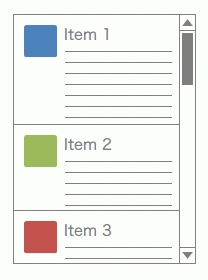

今回は .NET Framework で動作する UI フレームワーク、WPF 4 のお話です。

WPF では大量のアイテムを表示するために `ItemsControl` というコントロールが用いられますが、多くのアイテムを描画するには時間がかかる上、パフォーマンスの悪化にもつながります。
そこで WPF ではアイテムを高速かつ省メモリで描画するために、UI 仮想化という機能が用意されており、`ItemsControl` の派生コントロールである ListBox などではこれが既定でオンになっています。やったぜ！

というわけにもいかず……本題はここからです。  
`ListBox` ではアイテムをスクロールするときに、アイテム単位でのスクロールが行われます。
アイテム単位でのスクロールでは、ボックスからはみ出てしまった文字を読むことができないほか、アイテムによって高さが違う場合、スクロールしたときに読みにくくなってしまいます。

<!-- more -->

<div class="row" style="margin-bottom: 40px;">
<div class="col-sm-6 text-center">

  
アイテム単位スクロール
</div>
<div class="col-sm-6 text-center">

  
ピクセル単位スクロール
</div>
</div>

各アイテムが同じ高さである場合はアイテム単位スクロールでも使いにくくなることはありませんが、Twitter クライアントのようにアイテムごとの高さが違う場合は、これだとイマイチです。

WPF 4 では次のようにしてスクロール単位を切り替えることができます。

```xaml
<!-- アイテム単位スクロール -->
<ListBox ScrollViewer.CanContentScroll="True" />
<!-- ピクセル単位スクロール -->
<ListBox ScrollViewer.CanContentScroll="False" />
```

しかしながら、この方法でスクロール単位を切り替えると、UI 仮想化が無効に設定されるため、アプリケーションのパフォーマンスが悪化します。  
参考：[コントロールのパフォーマンスを最適化する - WPF .NET Framework | Microsoft Learn](https://learn.microsoft.com/ja-jp/dotnet/desktop/wpf/advanced/optimizing-performance-controls)

WPF 4.5 ではこれを解決するために、`VirtualizingPanel` に設定できる添付プロパティが追加されました。

```xaml
<!-- ScrollViewer.CanContentScroll が True のままでも仮想化される -->
<ListBox ScrollViewer.CanContentScroll="True"
         VirtualizingPanel.ScrollUnit="Pixel" />
```

しかしこれが使えるのは .NET Framework 4.5 以降……。
そこでこの記事では WPF 4 からこいつを使ってやろう、っていうわけです！（前置きが長い）

## コード

まあいろいろ言う前にまずはコードを。C# 側がこちら。

```csharp
using System;
using System.Reflection;
using System.Windows;
using System.Windows.Controls;

public class PixelBasedScrollBehavior
{
    #region IsEnabled 添付プロパティ

    public static bool GetIsEnabled(DependencyObject obj)
    {
        return (bool)obj.GetValue(IsEnabledProperty);
    }

    public static void SetIsEnabled(DependencyObject obj, bool value)
    {
        obj.SetValue(IsEnabledProperty, value);
    }

    public static readonly DependencyProperty IsEnabledProperty =
        DependencyProperty.RegisterAttached("IsEnabled", typeof(bool), typeof(PixelBasedScrollBehavior), new PropertyMetadata(false, IsEnabled_Changed));

    #endregion

    private static void IsEnabled_Changed(DependencyObject sender, DependencyPropertyChangedEventArgs e)
    {
        var itemsControl = sender as ItemsControl;
        var panel = sender as VirtualizingStackPanel;
        bool enabled = (bool)e.NewValue;

        try
        {
            if (itemsControl != null)
            {
                SetScrollUnitProperty(itemsControl, enabled);
            }
            if (panel != null)
            {
                SetScrollUnitProperty(panel, enabled);
                SetIsPixelBasedProperty(panel, enabled);
            }
        }
        catch { }
    }

    private static void SetScrollUnitProperty(DependencyObject sender, bool enabled)
    {
        var fieldInfo = typeof(VirtualizingPanel).GetField("ScrollUnitProperty", BindingFlags.Public | BindingFlags.Static | BindingFlags.FlattenHierarchy);
        if (fieldInfo == null)
        {
            return;
        }
        var property = (DependencyProperty)fieldInfo.GetValue(null);

        var type = typeof(Window).Assembly.GetType("System.Windows.Controls.ScrollUnit");
        if (type == null)
        {
            return;
        }
        var scrollUnitEnum = Enum.Parse(type, enabled ? "Pixel" : "Item");
        sender.SetValue(property, scrollUnitEnum);
    }

    private static void SetIsPixelBasedProperty(VirtualizingStackPanel sender, bool enabled)
    {
        var prop = typeof(VirtualizingStackPanel).GetProperty("IsPixelBased", BindingFlags.NonPublic | BindingFlags.Instance);
        if (prop == null)
        {
            return;
        }
        prop.SetValue(sender, enabled, null);
    }
}
```

XAML では次のように指定します。

```xaml
<ListBox behaviors:PixelBasedScrollBehavior.IsEnabled="True">
    <ListBox.ItemsPanel>
        <ItemsPanelTemplate>
            <VirtualizingStackPanel behaviors:PixelBasedScrollBehavior.IsEnabled="True" />
        </ItemsPanelTemplate>
    </ListBox.ItemsPanel>
</ListBox>
```

XAML 側の XML 名前空間は適切に設定してください。ここでは `behaviors:` としましたが自由に指定できます。

## 仕組み

実はこの機能、WPF 4 から使用することもできるものの、それにアクセスする手段は用意されていません。
そこでリフレクションを使用して、WPF で内部的に設定されている値をコード側から設定し直し、ピクセル単位のスクロールと UI 仮想化を両立させています。

コードではコントロールごとに次のプロパティを変更しています。

- `csharp¦System.Windows.Controls.ItemsControl`
  - `csharp¦System.Windows.Controls.VirtualizingPanel.ScrollUnitProperty` 依存関係プロパティ
- `csharp¦System.Windows.Controls.VirtualizingStackPanel`
  - `csharp¦System.Windows.Controls.VirtualizingPanel.ScrollUnitProperty` 依存関係プロパティ
  - `csharp¦System.Windows.Controls.VirtualizingStackPanel.IsPixelBased` プロパティ

## 誰得なの

分かりません。対応環境ならさっさと .NET 4.5 にアップデートした方がいいです……。（完）
