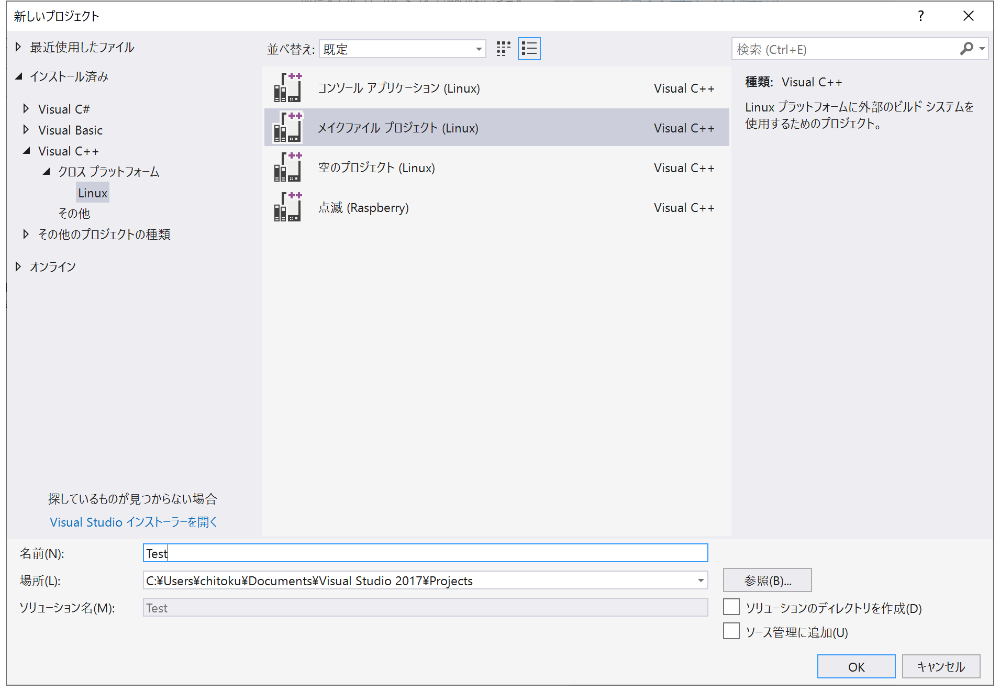
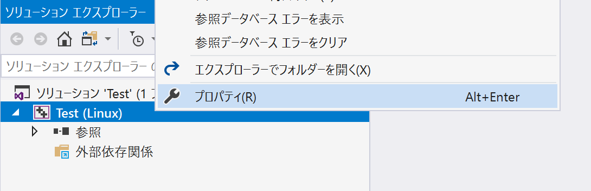
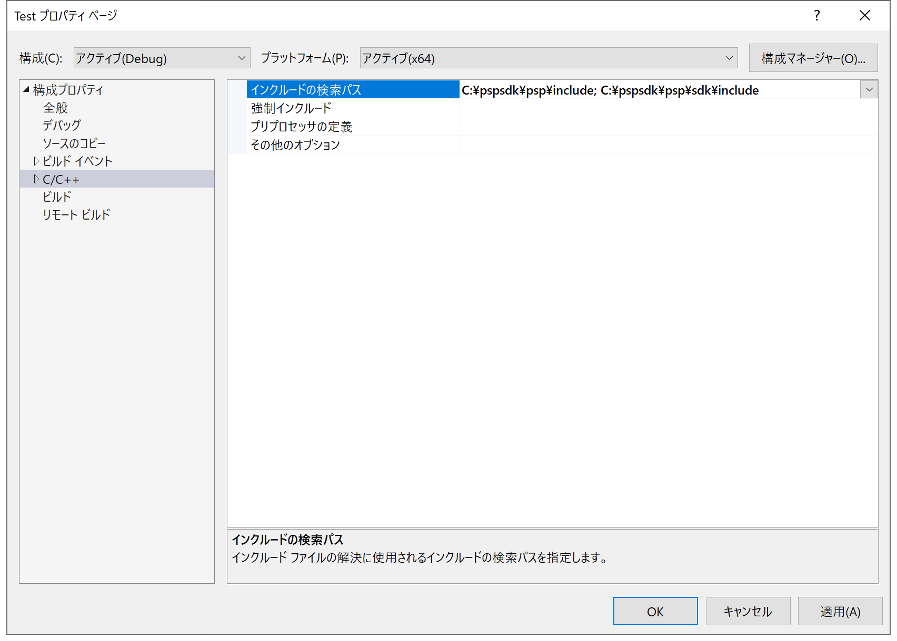
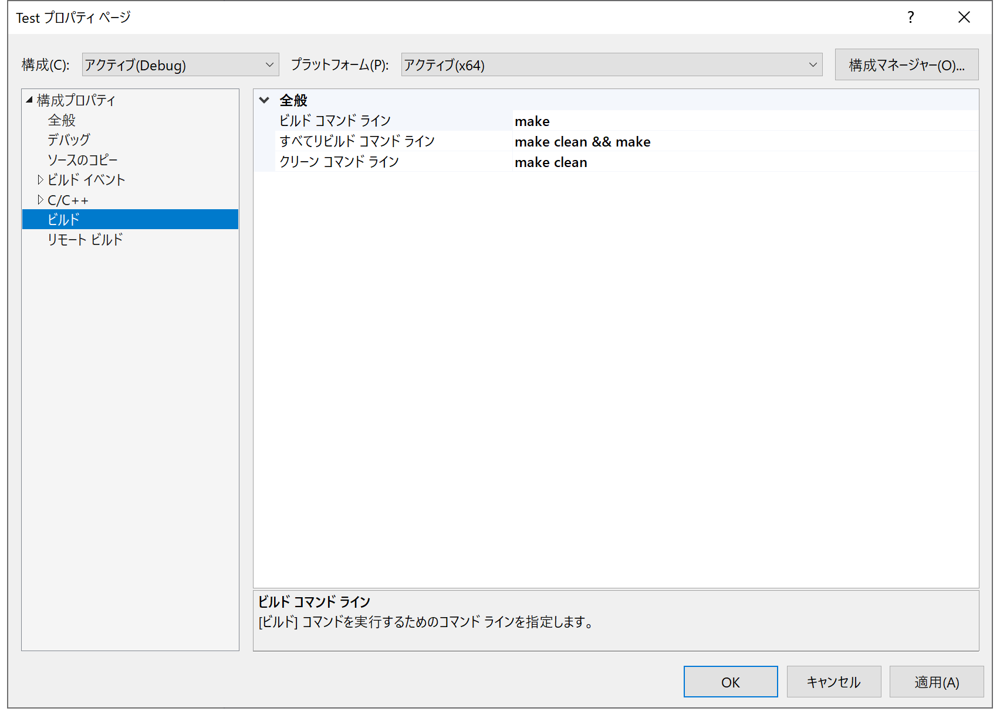

Makefile を作成したら Visual Studio のプロジェクトを作成します。
プロジェクトを作成したらそのフォルダーに[前回](/programming/psp/makefile)作成した Makefile を保存しておきます。

これは Windows で使用する開発環境を構築した場合の手順です。
Linux や macOS の場合は Makefile を作成して次の [Hello World のビルド](/programming/psp/helloworld)へ進んでください。

## 手順

1. 「ファイル(F)」→「新規作成(N)」→「プロジェクト(P)」で新しいプロジェクトを作成します。
1. 「インストール済み」→「Visual C++」→「クロス プラットフォーム」→「Linux」→「メイクファイル プロジェクト」を選びます。  
1. プロジェクト名を入力して「OK」で完了します。
1. プロジェクトが作成されたら「ソリューション エクスプローラー」でプロジェクトを右クリックして「プロパティ」を開きます。
1. 「C/C++」→「インクルードの検索パス」を以下のように変更します。
    - Minimalist PSPSDK の場合
        - C:\pspsdk\psp\include; C:\pspsdk\psp\sdk\include
    - devkitPro の場合
        - C:\devkitPro\devkitPSP\psp\include; C:\devkitPro\devkitPSP\psp\sdk\include
1. 「ビルド」を以下のように変更します。
    - ビルド コマンド ライン  
      `batch:make`
    - すべてリビルド コマンド ライン  
      `batch:make clean && make`
    - クリーン コマンド ライン  
      `batch:make clean`
1. 「OK」で完了します。

## 参考

上記の手順のスクリーンショットです。

↓

↓

↓

