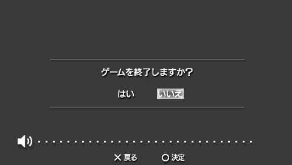

## 概要

[Hello World のビルド](/programming/psp/helloworld)で作成したプログラムは HOME ボタン（PS ボタン）で終了する機能が実装されておらず、
代わりに電源を切ってアプリケーションを終了する必要がありました。

今回はスレッドを作成して HOME ボタンが押されたときの処理をシステムに登録することで、
HOME ボタンを押したときに以下の「ゲームを終了しますか？」の画面を出して終了するようにしてみます。



## ソースコード

今回のソースコードです。コピーして実行してみてください。

```c{numberLines: true}
#include <pspkernel.h>
#include <pspdebug.h>
#include <pspdisplay.h>

PSP_MODULE_INFO("Hello World", PSP_MODULE_USER, 1, 1);
PSP_MAIN_THREAD_ATTR(PSP_THREAD_ATTR_USER);

static volatile int running = 1;

int ExitCallback(int arg1, int arg2, void *arg)
{
    running = 0;
    return 0;
}

SceUID CallbackThread(unsigned int args, void *argp)
{
    // 関数ポインターからコールバック関数を作成
    int callbackId = sceKernelCreateCallback("ExitCallback", ExitCallback, NULL);
    if (callbackId < 0) {
        return callbackId;
    }

    // 終了コールバックにコールバック関数を登録
    sceKernelRegisterExitCallback(callbackId);
    sceKernelSleepThreadCB();

    return 0;
}

SceUID SetupCallbacks(void)
{
    // 関数ポインターからスレッドを作成
    int threadId = sceKernelCreateThread("CallbackThread", CallbackThread, 0x11, 0xFA0, 0, NULL);
    if (threadId < 0) {
        return threadId;
    }

    // イベント監視スレッドを開始
    sceKernelStartThread(threadId, 0, NULL);

    return 0;
}

int main(int argc, char *argv[])
{
    // コールバック関数の読み込み
    SetupCallbacks();
    pspDebugScreenInit();

    while (running) {
        pspDebugScreenSetXY(0, 0);
        pspDebugScreenPrintf("Hello World!!\n");
        sceDisplayWaitVblankStart();
    }

    sceKernelExitGame();

    return 0;
}
```

## 仕組み

PSP のアプリケーションを HOME ボタンによる終了に対応させるためには、
終了処理のためのコールバックを `c:sceKernelRegisterExitCallback()` 関数を使ってシステムに登録する必要があります。
この関数に渡すコールバックは `c:sceKernelCreateCallback()` 関数を用いて作成することができ、今回の例ではユーザーが終了を選択したときにシステムによって呼び出されるようになっています。

また、これらの終了コールバックの登録処理は新規作成したスレッド上で行い、
作成したスレッドもコールバックが呼び出されるまでは `c:sceKernelSleepThreadCB()` 関数を使用して待機状態にしておきます。
こうしておくことで、メインスレッドでゲームのメインループを処理しながら終了コールバックを待ち受けておくことができるようになります。

ユーザーが終了を選択すると、終了コールバックに登録した `c:ExitCallback()` 関数が変数 `c:running` を `c:0` に変更します。
これによってメインループの `c: while (running) { ... }` の継続条件から外れてループが終了し、`c:sceKernelExitGame()` 関数がゲームを終了するという流れになります。

終了コールバックを登録しただけではゲームの終了は行われず、あくまでもプログラマーが終了を管理する必要がある点には注意が必要です。

## API リファレンス

<pspsdk-function name="sceKernelCreateCallback"></psp-sdk-function>

<pspsdk-function name="sceKernelRegisterExitCallback"></psp-sdk-function>

<pspsdk-function name="sceKernelSleepThreadCB"></psp-sdk-function>

<pspsdk-function name="sceKernelCreateThread"><div>

スレッドの種類は [Hello World のビルド](/programming/psp/helloworld#api-リファレンス)で紹介した `c:PSP_MAIN_THREAD_ATTR()` のものと同じです。

</div></psp-sdk-function>

<pspsdk-function name="sceKernelStartThread"></psp-sdk-function>

<pspsdk-function name="sceDisplayWaitVblankStart"></psp-sdk-function>

<pspsdk-function name="sceKernelExitGame"></psp-sdk-function>
