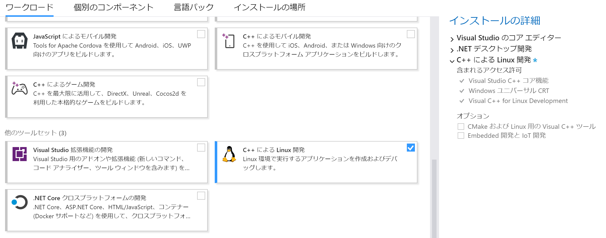

Minimalist PSPSDK は UNIX 上で動作する psptoolchain の Windows 版です。  
開発に使用するコンピューターが UNIX を実行している場合は、[psptoolchain](/programming/psp/psptoolchain) を参照します。

## Minimalist PSPSDK

1. [Minimalist PSPSDK](https://sourceforge.net/projects/minpspw/) からインストーラーをダウンロードします。
1. ダウンロードしたファイルを実行して指示に従ってインストールします。  
途中のインストール構成は、すべてにチェックを入れて進んでください。

## Visual Studio

IDE を使用すると開発環境によって入力補完などのサポートを受けることができるので導入しておきます。  
C/C++ の作業環境を自分で用意している場合はこの手順を飛ばしても構いません。

1. [Visual Studio をインストールし、好みの機能を選択する | Microsoft Learn](https://learn.microsoft.com/ja-jp/visualstudio/install/install-visual-studio) を参考に Visual Studio をインストールします。
1. ワークロードを選択する画面になったら [C++ による Linux 開発] にチェックを入れて次へ進めます。  
その際に右ペインに出てくる、[オプション] の [CMake および Linux 用の Visual C++ ツール] は使用しないのでチェックを外して構いません。

