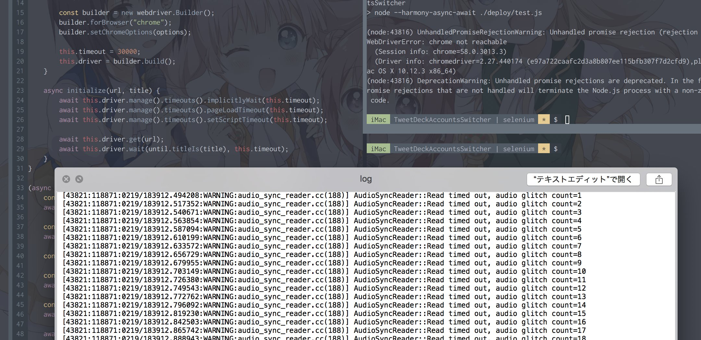

日頃からコードをお書きになるみなさんなら、三度の飯よりテストですよね？

今回は Chrome 拡張「TweetDeck Accounts Switcher」を Travis CI/AppVeyor 上でテストしてみました。

## 用意するもの

- GitHub アカウント
- Travis CI アカウント
- Google Chrome
- Node.js

## 環境構築

<div class="text-center">
<p style="margin: 100px 0;">はじめに macOS で試してみます。</p>
<p style="margin: 100px 0;">Node.js でドライバーを読み込んで……。</p>
</div>

<!-- more -->

<div class="text-center">


<p style="margin: 100px 0;">ちくちょう！ だいなしにしやがった！ お前はいつもそうだ。</p>


<p style="margin: 100px 0;">このフリーズした TweetDeck はお前の人生そのものだ。</p>
</div>

```
(node:43816) UnhandledPromiseRejectionWarning: Unhandled promise rejection (rejection
WebDriverError: chrome not reachable
  (Session info: chrome=58.0.3013.3)
  (Driver info: chromedriver=2.27.440174 (e97a722caafc2d3a8b807ee115bfb307f7d2cfd9),pl
ac OS X 10.12.3 x86_64)
(node:43816) DeprecationWarning: Unhandled promise rejections are deprecated. In the f
romise rejections that are not handled will terminate the Node.js process with a non-z
 code.
```

<div class="text-center">
<p style="margin: 100px 0;">誰もお前を愛さない。</p>
</div>

## 閑話休題

macOS で動かないときがありましたが、神に許しを請えば多分大丈夫なので先へ行きます。

Travis CI では Linux と macOS に対するサポートを提供しているので、ここではどちらでも動かせるように .travis.yml を仕込みました。

## Travis CI: Linux

apt を用いて `google-chrome-stable` をインストールします。

Travis CI での実行時はディスプレイを持たない環境となるので、`xvfb`（X virtual framebuffer）を用いてヘッドレスで動いてもらう必要があります。
環境変数 `DISPLAY` をセットしておくといい感じにしてくれます。

`gist:chitoku-k/67068aa62aa3f077f5307ca9a822ce74#.travis.linux.yml`

## Travis CI: macOS

brew cask を用いて `google-chrome` を /Applications にインストールします。これだけで動いたので手元の環境とは大違いで割と素直でした。

`gist:chitoku-k/67068aa62aa3f077f5307ca9a822ce74#.travis.macos.yml`

## AppVeyor: Windows

AppVeyor では Chrome も ChromeDriver も元から入っています。神。

## ドライバー: ChromeDriver

package.json では Node.js の chromedriver と selenium-webdriver を使用しています。
この chromedriver は Google から最新の ChromeDriver を取得して node_modules に置いてくれることに加えて、selenium-webdriver にもそのパスを渡してくれるスグレモノです。
npm に依存したくなければ簡単なシェルスクリプトでも良いと思います。

`gist:chitoku-k/67068aa62aa3f077f5307ca9a822ce74#package.json`

テストを実行する際は Chrome の起動オプションに `--no-sandbox` を追加しないとキー操作などが行えないので注意が必要です。

`gist:chitoku-k/67068aa62aa3f077f5307ca9a822ce74#test.js`

あとはテストを書くだけです！ お疲れさまでした！

API ドキュメント: [Selenium WebDriver JavaScript API](https://www.selenium.dev/selenium/docs/api/javascript/index.html)
