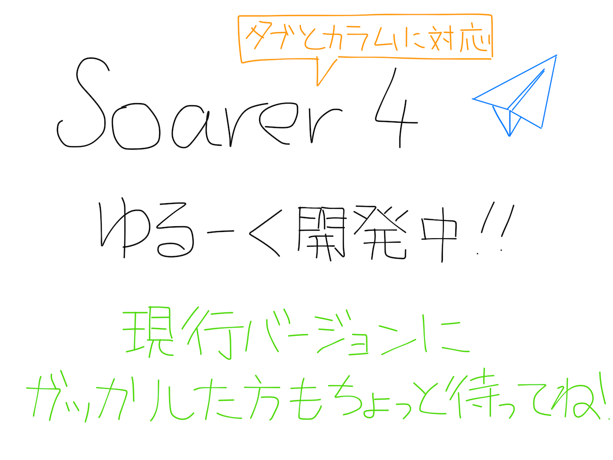
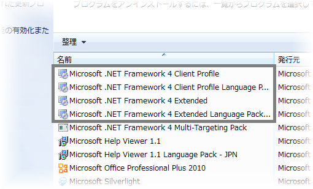

Twitter によってアプリケーションの機能が制限されました。もうめんどくさいので対応しません。（2015/12/30）

---

{style="width: 690px; max-width: 100%;"}

---

<soarer-download />

---

## Twitter 認証について

Soarer for Windows では、「アクティビティー」に関する Twitter API の仕様上、入力された ID とパスワードをもとに **Soarer for Windows と Twitter for iPhone の 2 つのアプリケーションに対して OAuth 認証**を行います。予めご了承の上お使いください。

## 対応環境

**以下のいずれかがインストールされた**オペレーティングシステム

- .NET Framework 4
- .NET Framework 4.5/4.5.1/4.5.2
- .NET Framework 4.6

（実行可能なのは Windows XP 以降のみで、.NET Framework はセットアップされている場合がほとんどです）

## .NET Framework のバージョンの確認方法

「スタート」→「コントロール パネル」→「プログラムのアンインストール」の中から「.NET Framework 4～」を探します。  
存在しない場合は [Microsoft Download Center](https://www.microsoft.com/ja-jp/download/details.aspx?id=48130) からダウンロードして下さい。

