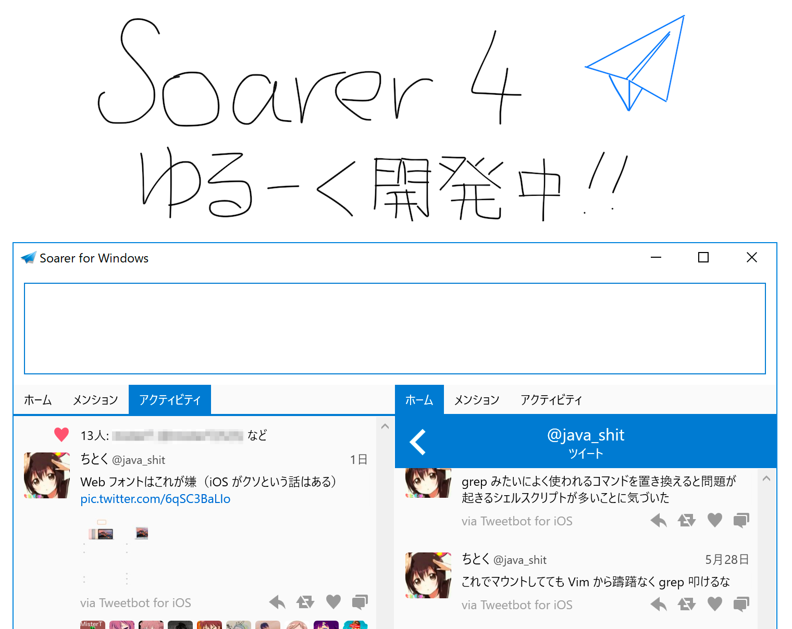
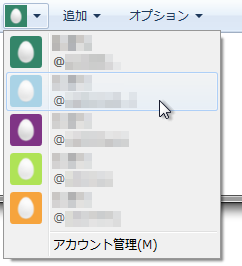
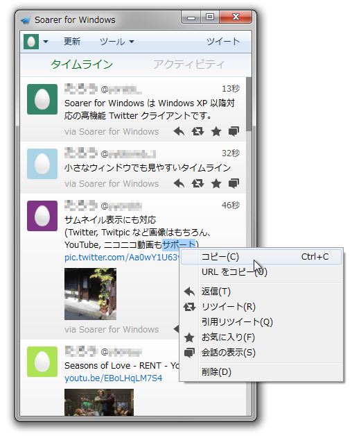

Twitter によってアプリケーションの機能が制限されました。もうめんどくさいので対応しません。（2015/12/30）

---

{style="width: 760px; max-width: 100%;"}

---

<h2 class="no-border">

サイズの小さなウィンドウでも

快適な Twitter クライアント。

</h2>

画面の狭いディスプレイでも、別のウィンドウの隣に並べて小さめな幅でも。

シングルカラムなので、画面の隅においても快適に Twitter を楽しめます。
ツイートするときも、別ウィンドウなので場所をとりません。
タイムラインを閉じても大丈夫。Twitter がもっと身近になります。

[ダウンロードはこちら ▶](/softwares/soarer/download){class="btn btn-primary btn-lg"}

---

## 必要最低限のシンプルな作り。
{class="no-border"}

必要な機能を必要なときだけ。ウィンドウの大きさが自在に変化。ぜひお試しください。アカウントの切り替えも簡単です。

---

## つぶやくまで最速
{class="no-border"}

多機能ながら動作は軽快です。
高速な起動に加え、ログイン中でもツイートを入力することができるので、ふと思ったことでもすぐにつぶやくことができます。

