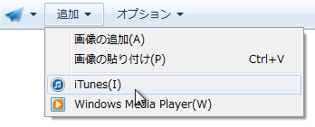
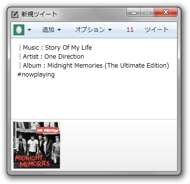
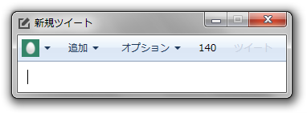
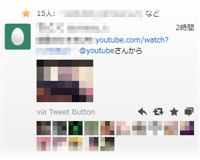
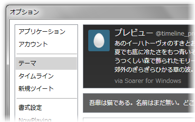
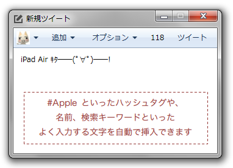
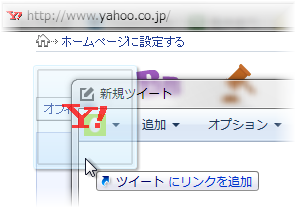

Twitter によってアプリケーションの機能が制限されました。もうめんどくさいので対応しません。（2015/12/30）

---

## NowPlaying をもっと気軽に。
{class="no-border"}

パソコンで聞いている曲を Twitter で共有するのも簡単。ツイートウィンドウを開いたら、「追加」ボタンをクリックして、メニューから選択するだけ。

iTunes / Windows Media Player に対応しており、ともにアルバムアートワークを添付してツイートできます。

※ NowPlaying ツイートの書式は設定から変更でき、曲名、アーティスト名、アルバム名を任意の位置に挿入することができます。

---

## 邪魔にならない
{class="no-border"}

ツイートウィンドウの大きさはこの通り。タイムラインとは別のウィンドウなのでシンプルで作業の邪魔になりません。
他のウィンドウより手前に表示するように設定することもできます。

---

## Twitter をもっと楽しく。
{class="no-border"}

タイムラインの流れが速すぎたときでも、大丈夫。
Twitter の公式 Web のように、あとから、お気に入り登録やリツイート、返信などをちゃんと確認できます。

※ 現在は通知機能がありません。将来的に対応する予定です。

[ダウンロードはこちら ▶](/softwares/soarer/download){class="btn btn-primary btn-lg"}

---

## 設定はお好みで。
{class="no-border"}

ミュート、タイムラインのテーマ、送信に使うショートカットキー、表示フォント、リツイートの書式。
快適に使える設定は人それぞれなのでなるべく自由度の高い設定項目を心がけています。自分好みの設定をぜひ見つけてください。

---

## 同じ話題をみんなで共有。
{class="no-border"}

ハッシュタグ（例：#Apple）などのテンプレートを保存できるようになりました。
共通の興味のあるユーザーと、ハッシュタグを通して話題を共有したり、特定の文字列の入力を省略したりすることができます。

たとえば、企業の会見や発表、イベントの実況中継などで、多くのユーザーとの意見交換を行う際などに便利です。
指定されたテンプレートはユーザーによって無効にされるまでは自動的にツイートの指定位置に挿入され続けます。

---

## Web ページの共有も簡単に。
{class="no-border"}

見ている Web ページの共有も簡単です。
お使いの Web ブラウザーのアドレスバーのアイコンを Soarer のツイートウィンドウにドラッグ・アンド・ドロップするだけ。
簡単操作で、自動的に見ているページ名と URL がツイートに挿入されます。

