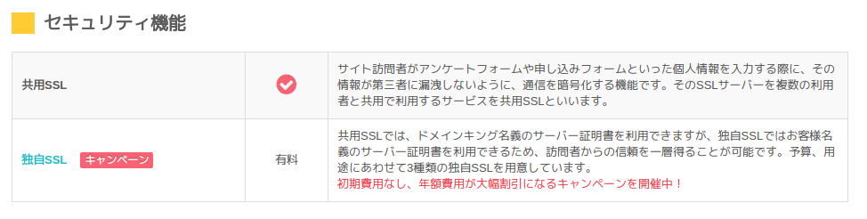
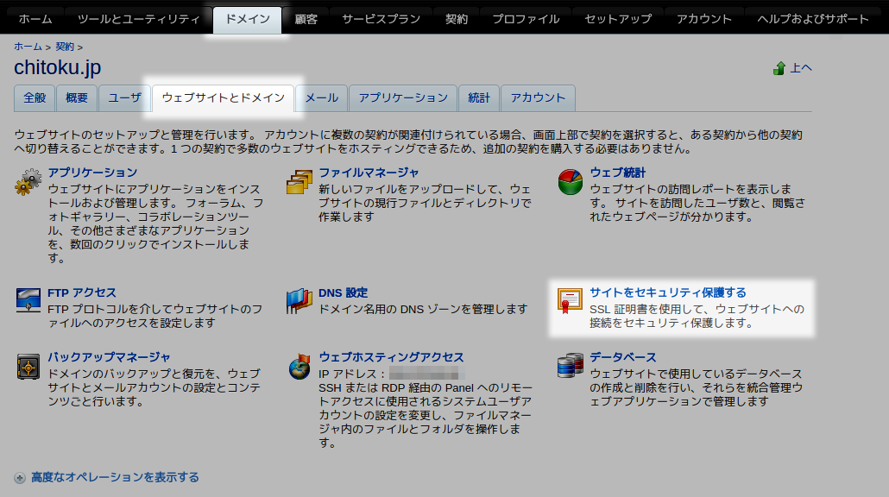
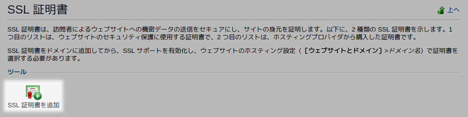
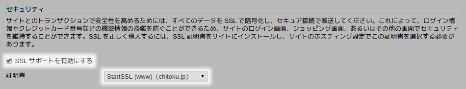

月 100 円程度から利用できる格安レンタルサーバーの[ドメインキング](https://www.domainking.jp/)ですが、紹介ページを見る限り独自 SSL を利用する際は別途利用料金が必要なように見えます。



しかしこれはあくまで**ドメインキングで証明書を購入した場合**の料金記載で、どこにも書かれていないものの、コントロールパネルより**自前の SSL 証明書を適用することが可能**になっています。

たとえば [StartSSL](https://www.startssl.com/) などの無料で証明書を発行できるサービスを利用することで、ドメインキングでも料金はそのままで安全な通信を行うように設定することもできます。

<!-- more -->

## SSL 証明書を用意する

まずは SSL 証明書を用意します。
後述のコントロールパネルから自己署名証明書（いわゆるオレオレ証明書）の作成も可能ですが、信頼性に欠ける上、大抵のブラウザーでエラーが表示されるため避けたほうがよいでしょう。

StartSSL を使用して SSL 証明書を発行する手順は以下の記事がオススメです。
記事にしたがって公開鍵の発行まで済ませれば準備はバッチリです。

[無料のSSL証明書StartSSLを活用する - Qiita](https://qiita.com/k-shogo/items/870b6d3939dd08da2de4)

## 証明書の結合

つづいてルート証明書と中間証明書を用意します。（例は StartSSL の場合）

| 証明書の種類 | URL                                        |
| ------------ | ------------------------------------------ |
| ルート証明書 | https://www.startssl.com/certs/ca.pem      |
| 中間証明書   | https://startssl.com/certs/sca.server1.crt |

## 秘密鍵のパスフレーズの解除

また、秘密鍵についてはパスフレーズが設定されている状態では利用できないのであらかじめ復号しておきます。  
（StartSSL の ToolBox -> Decrypt Private Key を利用することでも復号できます、お好きな方で）

```shell
$ openssl rsa -in ssl.key -out ssl.key
```

## 証明書の設定

1. コントロールパネルにログインする
2. 上部 \[ドメイン\] より \[ウェブサイトとドメイン\] タブを選択し、\[サイトをセキュリティ保護する\] を開く  

3. \[SSL 証明書を追加\] を開く  

4. 最下部の \[証明書をテキストとしてアップロード\] に必要な情報を貼り付けて \[テキスト送信\] をクリックする  
秘密鍵には復号済みの \*.key ファイルを、証明書はサーバー証明書を、CA 証明書には中間証明書を指定します。

## ホスティング設定

続いて証明書を設定したいドメインのホスティング設定画面を開きます。  
\[セキュリティ\] の \[SSL サポートを有効にする\] にチェックを入れ、先ほどインストールした証明書を指定します。



## お疲れさまでした

正しく設定できていれば無事 https:// でアクセスできるようになっているはずです。  
.htaccess によるリダイレクトや WordPress の再設定などもお忘れなく！
