わたしの PC では今まで Windows と Linux を 1 枚の SSD にインストールしていていましたが、SSD をもう 1 枚入手したので引越しと領域拡張をしてみました。
今回は Windows で動作する「[MiniTool Partition Wizard](https://www.partitionwizard.jp/free-partition-manager.html)」の無料版を使ってこの SSD のパーティションを引っ越し、余った領域にデータ用のパーティションを拡大してみます。

## 引っ越し前

いずれの SSD も GPT 方式のパーティションテーブルで、引っ越し前は SSD #1 に Windows が 320 GiB で Linux が 140 GiB、その他の領域にシステム用のパーティションとスワップを割り当てています。

目標は SSD #2 に SSD #1 の Linux 領域を移動し、移動することで増加した領域にパーティションを拡張することです。
注意点としては MiniTool Partition Wizard 無料版は Linux LVM の領域の拡張をサポートしていないため、SSD #2 の一部の作業は Linux 上で実施します。

引っ越し前後で括弧内の番号が対応しているパーティションはデータをそのまま移動し、スワップなどのデータを保持する必要がないパーティションは新規作成としています。

**略語:**  
[ESP](https://wiki.archlinux.jp/index.php/EFI_%E3%82%B7%E3%82%B9%E3%83%86%E3%83%A0%E3%83%91%E3%83%BC%E3%83%86%E3%82%A3%E3%82%B7%E3%83%A7%E3%83%B3): EFI System Partition  
[MSR](https://learn.microsoft.com/ja-jp/windows-hardware/manufacture/desktop/configure-uefigpt-based-hard-drive-partitions): Microsoft Reserved Partition  
[WinRE](https://learn.microsoft.com/ja-jp/windows-hardware/manufacture/desktop/windows-recovery-environment--windows-re--technical-reference): Windows Recovery Environment  
[LVM](https://wiki.archlinux.jp/index.php/LVM): Logical Volume Manager

### SSD #1（引っ越し前）

(1) ESP FAT32 512 MiB

(2) MSR - 128 MiB

(3) Windows NTFS 320 GiB

(4) WinRE NTFS 512 MiB

Swap Linux Swap 5 GiB

(5) Linux Linux LVM 140 GiB

### SSD #2（引っ越し前）

なし - 512 GB

<!-- more -->

## 手順: コピー＆削除作業

まず MiniTool Partition Wizard で以下のように作業してみます。

1. SSD #2 のパーティションをすべて削除
1. SSD #2 の 1 番目に ESP 用の FAT32 パーティションを作成（512 MiB）
1. SSD #2 の 2 番目にスワップ用の Linux Swap パーティションを作成（5 GiB）
1. SSD #1 の 6 番目の (5) Linux LVM パーティションを SSD #2 の 3 番目にコピー
1. 4\. でコピー元となった SSD #1 の 6 番目の (5) Linux LVM パーティションを削除

### SSD #1（5. 完了後）

(1) ESP FAT32 512 MiB

(2) MSR - 128 MiB

(3) Windows NTFS 320 GiB

(4) WinRE NTFS 512 MiB

なし - 145 GiB

### SSD #2（5. 完了後）

空 FAT32 512 MiB

空 Linux Swap 5 GiB

(5) Linux Linux LVM 140 GiB

なし - 331 GiB

## 手順: 移動作業

「コピー＆削除作業」が完了すると「なし」の領域が SSD #1 と SSD #2 に残った状態になります。
続いて MiniTool Partition Wizard で SSD #1 の (4) WinRE を SSD #1 の末尾に移動します。
なお、SSD #2 の Linux LVM は MiniTool Partition Wizard 無料版では拡張することができません。

6. SSD #1 の 4 番目の (4) WinRE パーティションをボリュームの末尾に移動

### SSD #1（6. 完了後）

(1) ESP FAT32 512 MiB

(2) MSR - 128 MiB

(3) Windows NTFS 320 GiB

なし - 145 GiB

(4) WinRE NTFS 564 MiB

### SSD #2（6. 完了後）

空 FAT32 512 MiB

空 Linux Swap 5 GiB

(5) Linux Linux LVM 140 GiB

なし - 331 GiB

## 手順: 拡張作業（Windows）

「移動作業」が完了すると「なし」の領域が SSD #1 の (3) Windows パーティションの直後にくるので (3) と連結して拡張することが可能になります。

7. SSD #1 の (3) Windows パーティションを「なし」の領域に拡張する

### SSD #1（7. 完了後）

(1) ESP FAT32 512 MiB

(2) MSR - 128 MiB

(3) Windows NTFS 465 GiB

(4) WinRE NTFS 564 MiB

### SSD #2（7. 完了後）

空 FAT32 512 MiB

空 Linux Swap 5 GiB

(5) Linux Linux LVM 140 GiB

なし - 331 GiB

## MiniTool Partition Wizard

それでは MiniTool Partition Wizard での作業が整理できたところで実際にやってみます。
MiniTool Partition Wizard 無料版は以下の Web サイトからダウンロードできます。

* [MiniTool Partition Wizard ダウンロード センター](https://www.partitionwizard.jp/download.html)

ダウンロードされたインストーラーを手順通りに進めて起動すると以下のような画面になります。
MiniTool Partition Wizard では現在選択されているパーティションで実行可能な操作だけが左側のペインに表示されるようになっています。
各操作は左下の［適用］ボタンを押すまでは［保留中］として扱われ、適用する前であれば間違えても取り消すことができるので安心です。

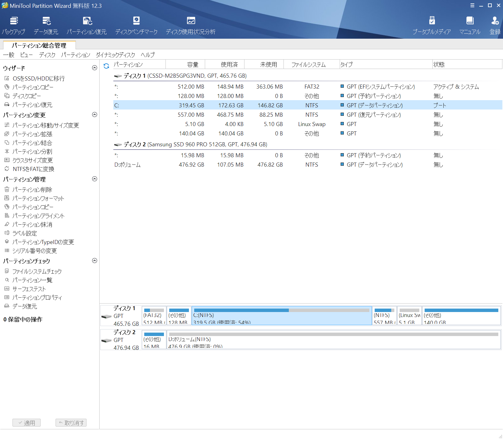

### 1. SSD #2 のパーティションをすべて削除

まずはディスクに対する操作です。
対象のディスクを右クリックして実行できます。

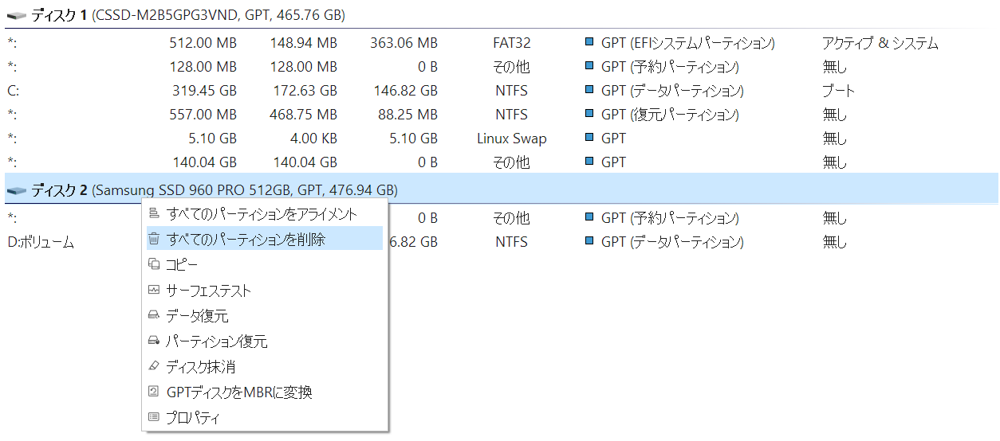

### 2. SSD #2 の 1 番目に ESP 用の FAT32 パーティションを作成

続いてはパーティションの作成です。
パーティションを作成したい［ファイルシステム］が［未割り当て］の項目で右クリックして［新規作成］をクリックします。

［パーティション新規作成］ウィンドウで必要な項目を入力して［OK］をクリックします。
ここでは ESP を FAT32 で作成するため、［ドライブ文字］は［無し］に、［ファイルシステム］は［FAT32］に設定した上で［前の未割り当て領域］が 0.00 GB なのを確認して作成します。

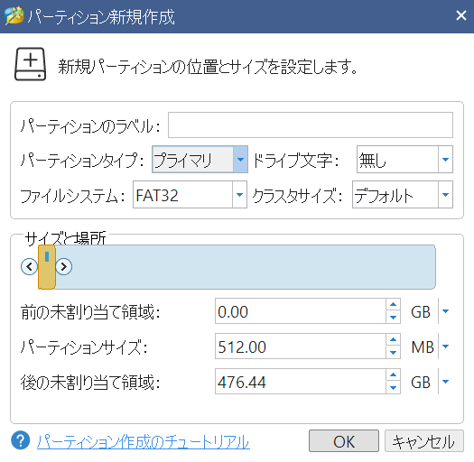

ESP はパーティションの GUID を ESP のものに変更する必要がありますが、MiniTool Partition Wizard 無料版では［パーティションTypeIDの変更］機能は使用できませんでした。

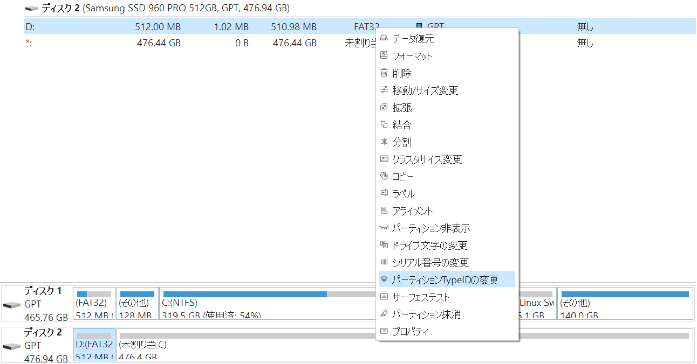

[バージョン別機能一覧](https://www.partitionwizard.jp/comparison.html)によるとこの機能を利用するにはプロ版以上が必要なようです。

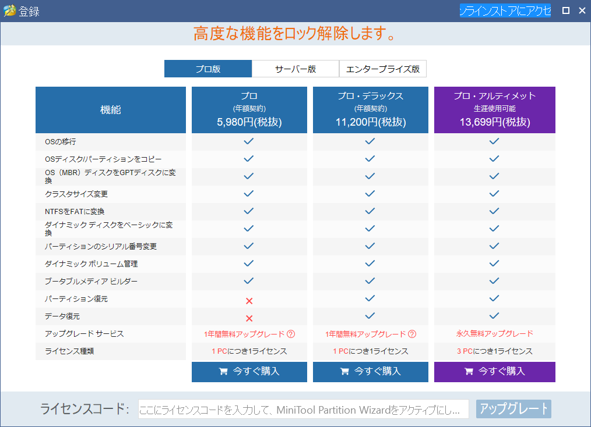

### 3. SSD #2 の 2 番目にスワップ用の Linux Swap パーティションを作成

2\. と同様に［パーティション新規作成］ウィンドウで［ドライブ文字］は［無し］に、［ファイルシステム］は［Linux Swap］に設定して作成します。

なお、パーティション新規作成画面でサポートされているファイルシステムはバージョン 12.3 の時点で以下の通りでした。
これらに加え、［未フォーマット］を指定することでフォーマットされていない状態のパーティションを作成することもできます。

* FAT
* FAT32
* exFAT
* NTFS
* ext2
* ext3
* ext4
* Linux Swap

### 4. SSD #1 の 6 番目の (5) Linux LVM パーティションを SSD #2 の 3 番目にコピー

パーティション管理ソフトを使用する価値が大きい作業の一つとしてデータのコピーが挙げられますが、MiniTool Partition Wizard では上記でサポートされていない Linux LVM のパーティションもコピーすることが可能です。

まずコピー元のパーティションを右クリックして［コピー］をクリックします。

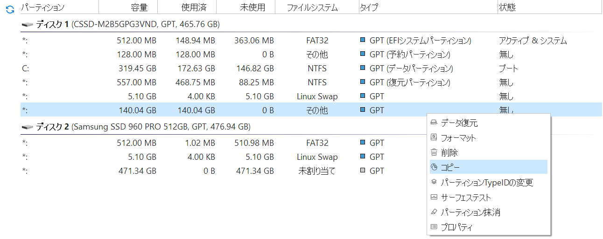

続いて［パーティションコピー］ウィンドウでコピー先の［未割り当て］パーティションを選択して［次へ(N) \>］をクリックします。

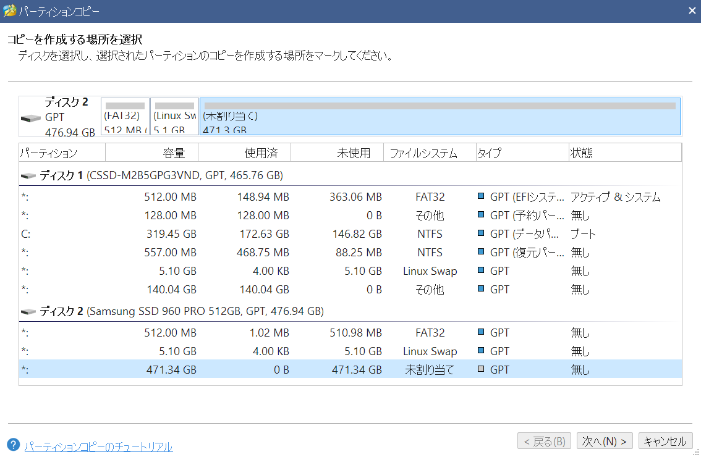

ファイルシステムがサポートされているものである場合はこの画面で同時にパーティションサイズを変更することが可能です。
今回は Linux LVM であるため、パーティション位置のみが変更可能でした。

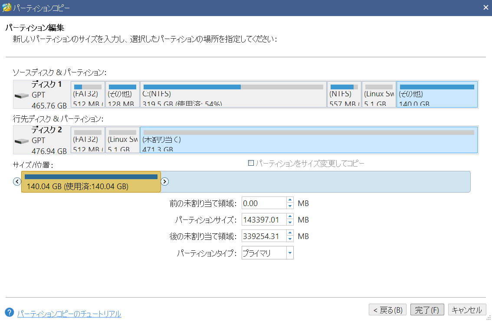

### 適用

1\.〜4\. のコピーする部分までを適用してみます。左下に［保留中の操作］という表示があり、7 個の保留中の操作があることが表示されています。
中央下のパーティションレイアウトに表示されている適用後の状態が想定したとおりであれば［適用］をクリックします。

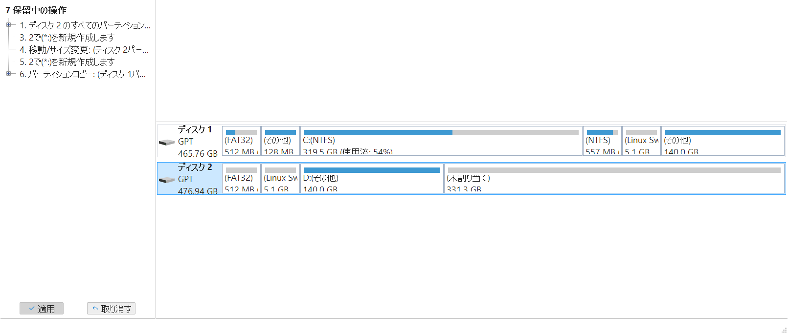

SSD で作業したためコピーも含めて数分で終了しました。

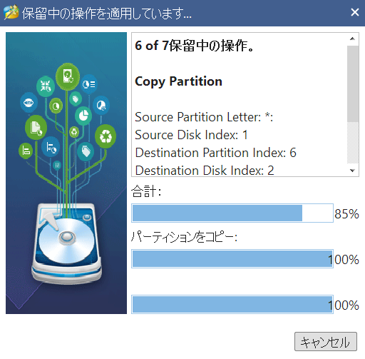

### 5. 4. でコピー元となった SSD #1 の 6 番目の (5) Linux LVM パーティションを削除

4\. のコピーが完了したのを確認したら、削除するパーティションを右リックして［削除］をクリックします。

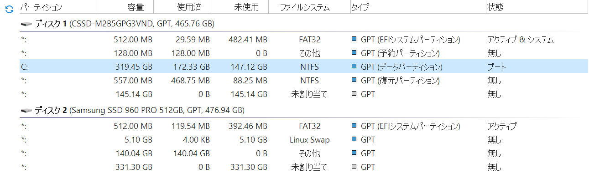

### 6. SSD #1 の 4 番目の (4) WinRE パーティションをボリュームの末尾に移動

(4) WinRE パーティションの直後にある［未割り当て領域］を (4) の直前に移動します。

(1) ESP FAT32 512 MiB

(2) MSR - 128 MiB

(3) Windows NTFS 320 GiB

(4) WinRE NTFS 512 MiB

なし - 145 GiB

↓ (4) と「なし」を入れ替え

(1) ESP FAT32 512 MiB

(2) MSR - 128 MiB

(3) Windows NTFS 320 GiB

なし - 145 GiB

(4) WinRE NTFS 564 MiB

移動したいパーティションを右クリックして［移動/サイズ変更］をクリックします。

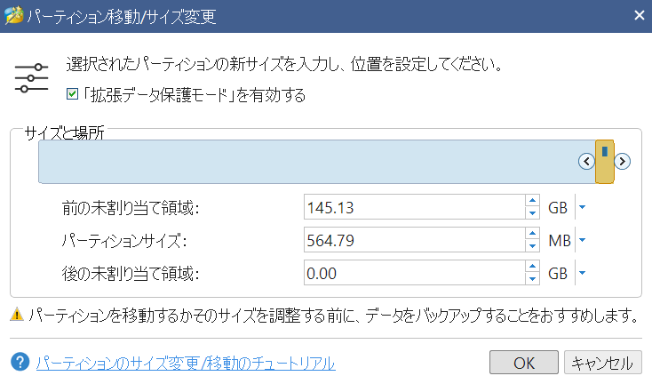

［パーティション移動/サイズ変更］ウィンドウではパーティションをドラッグ・アンド・ドロップで自由に移動することができます。
ここでは末尾に移動したいので［サイズと場所］でオレンジ色で表示されている部分を末尾にドラッグ・アンド・ドロップして［OK］をクリックします。

なお、移動時にパーティションサイズがアライメントの関係で変更される可能性があります。

### 7. SSD #1 の (3) Windows パーティションを「なし」の領域に拡張する

続いて、(3) Windows と［未割り当て］パーティションを結合することで (3) の領域を拡張します。

領域を拡張したいパーティションを右クリックして［拡張］をクリックします。

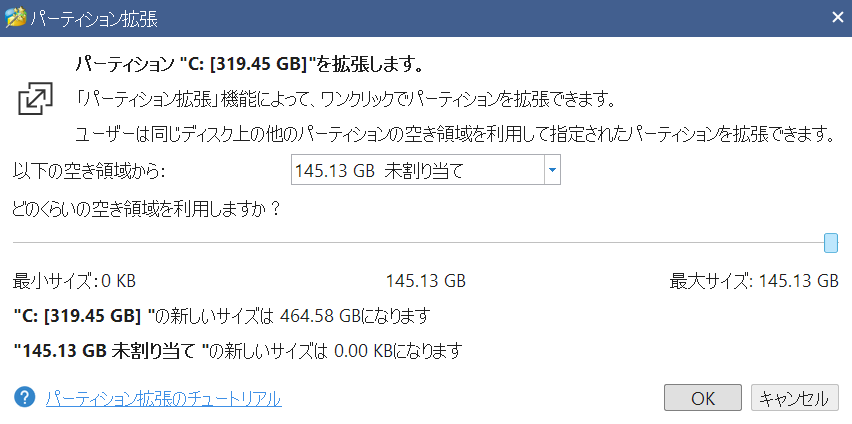

［以下の空き領域から］ドロップダウンリストで 6\. で移動した［未割り当て］パーティションが選択されていることを確認します。
今回は最大サイズまで拡張するため、スライダーを最大サイズに合わせてドラッグ・アンド・ドロップして［OK］をクリックします。

### 適用

5\.〜7\. を適用するために、［保留中の操作］から［適用］をクリックします。

## 所感

MiniTool Partition Wizard は無料版でも多くのユーザーには十分な機能が提供されており、diskpart や gdisk といったコマンドラインツールに慣れていなくても、直感的な操作でパーティション操作を行うことができると感じました。
特にパーティションの中身をコピーしたり拡張したりといった操作は GUI で処理後の様子が表示されていると間違いにくくなりそうです。

ただ、高 DPI 環境において Windows の設定で［拡大縮小とレイアウト］を 100% 以外に設定して表示を拡大している場合に、ウィンドウ全体がボヤけた表示になってしまうのが気になりました。
今回は Windows の［高 DPI スケール設定の上書き］設定から［拡大縮小の実行元］を［アプリケーション］に変更して起動したところ一部の文字がはみ出る程度の問題で済みましたが、今後は高 DPI スケーリングに標準で対応されると嬉しいと思いました。

また今回サポートされていなかった Linux LVM については Windows から扱うのは現実的ではなく、そのパーティションの管理は Linux のみで行うのが賢明です。

MiniTool Partition Wizard 無料版は以下の Web サイトからダウンロードできます。

* [MiniTool Partition Wizard ダウンロード センター](https://www.partitionwizard.jp/download.html)

### MiniTool Partition Wizard（7. 完了後）

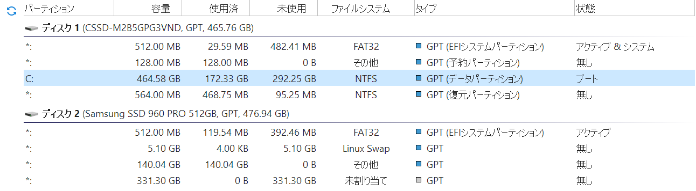

### SSD #1（7. 完了後）

(1) ESP FAT32 512 MiB

(2) MSR - 128 MiB

(3) Windows NTFS 465 GiB

(4) WinRE NTFS 564 MiB

### SSD #2（7. 完了後）

空 FAT32 512 MiB

空 Linux Swap 5 GiB

(5) Linux Linux LVM 140 GiB

なし - 331 GiB

## おまけ: 拡張作業（Linux LVM）

SSD #2 の Linux LVM は `gdisk` などのコマンドラインツールを利用することで拡張することができます。
ここでは詳細には紹介しませんが (5) Linux パーティションを削除してから同じ先頭セクターに Linux LVM パーティションを作成すれば拡張は完了します。
この操作ではデータの削除操作は行われませんが、パーティションテーブルを破壊しないように気をつけたほうが良いでしょう。

### SSD #1（引っ越し後）

(1) ESP FAT32 512 MiB

(2) MSR - 128 MiB

(3) Windows NTFS 465 GiB

(4) WinRE NTFS 564 MiB

### SSD #2（引っ越し後）

空 FAT32 512 MiB

空 Linux Swap 5 GiB

(5) Linux Linux LVM 471 GiB

