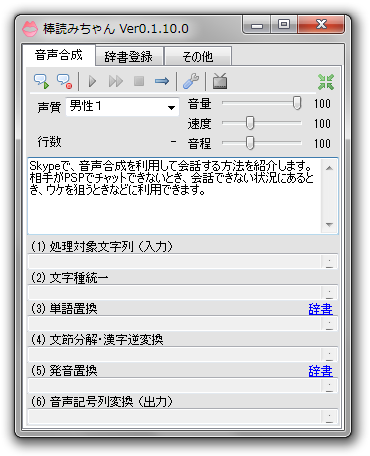

キーボード入力の面倒なとき、一度は憧れるのが音声認識。
Google の CM なんかでも話題のこの近未来的(?)な技術ですが、実は Windows や Mac の比較的新しい OS であれば手軽に利用することができます。
CM のようにシーンが限られるわけではないのでなかなか正しく認識させるにはコツがいりますが、意外と楽に入力できるかもしれません。

<!-- more -->

## 音声認識（Windows XP 編）

Windows XP には音声認識を利用するためのソフトウェアが標準ではインストールされていません。
ここでは Microsoft Office を使う方法と、ファイルをダウンロードしてセットアップを行う方法の 2 種類を紹介します。

### Microsoft Office でセットアップする

1. Microsoft Office Word を起動します。
2. \[ツール\] → \[音声\] とクリックします。（セットアップが行われます）  
   
3. \[スタート\] → \[コントロール パネル\] → \[サウンド、音声、およびオーディオ デバイス\] とクリックします。
4. \[音声認識\] → \[マイクの構成\] をクリックします。  
   
5. \[プロファイルのトレーニング\] をクリックします。  
   
6. セットアップは終了です。  
   Word の画面に戻ると音声入力を行うことができます。  
   

### ファイルをダウンロードしてセットアップする

1. [Speech SDK 5.1](https://www.microsoft.com/en-us/download/details.aspx?id=10121) を開きます。
2. SpeechSDK51.exe, SpeechSDK51LangPack.exe をダウンロードします。
3. 上の表記の順にセットアップを実行します。  
   適当なフォルダを指定して UnZip をクリックし、展開された Setup.exe を実行します。
4. \[スタート\] → \[コントロール パネル\] → \[サウンド、音声、およびオーディオ デバイス\] とクリックします。
5. \[音声認識\] をクリックし、言語で \[Microsoft Japanese Recognizer v5.1\] を選択します。
6. \[マイクの構成\] をクリックします。  
   
7. \[プロファイルのトレーニング\] をクリックします。  
   
8. セットアップは終了です。

入力は音声認識に対応したアプリケーションで行う必要があります。  
ここではサンプルとして内蔵されている Simple Dictation を試してみます。

1. \[スタート\] → \[すべてのプログラム\] → \[Microsoft Speech SDK 5.1\] → \[C++ Samples\] → \[Simple Dictation\] とクリックします。
2. 音声入力を行うことができます。（改行は Ctrl + Enter）  
   

### 音声認識（Windows Vista 以降編）

1. \[スタート\] → \[コントロール パネル\] → \[コンピューターの簡単操作\] → \[音声操作\] とクリックします。
2. \[マイクのセットアップ\] をクリックします。  
   
3. \[音声認識チュートリアルの実施\] をクリックし、手順通りに進めます。
4. \[コンピューターをトレーニングして認識精度を上げる\] をクリックします。  
   

入力は任意のアプリケーションで行うことができます。  
ここではメモ帳で試してみます。

1. \[スタート\] → \[コントロール パネル\] → \[コンピューターの簡単操作\] → \[音声操作\] → \[音声認識の開始\] をクリックします。  
   青いマイクのアイコンをクリックすると聞き取りが始まります。  
   
2. 「メモ帳を起動」と言うとメモ帳が起動します。  
   入力したいことを言うと自動的に入力され、また修正も簡単に行うことができるようになっています。  
   

## 音声合成

番外編として、パソコンに文字を入力するのではなく、逆にパソコンが文章を読み上げる「音声合成」も試してみます。
ここでは、無料で公開されている「棒読みちゃん」というソフトウェアを使用します。

1. [棒読みちゃん](https://chi.usamimi.info/Program/Application/BouyomiChan/)のホームページを開きます。
2. 中央の \[ダウンロードはこちら\] からダウンロードします。
3. ダウンロードしたファイルを展開（解凍）します。
4. 展開したファイルの中にある、唇のアイコンの BouyomiChan.exe を起動します。  
     
   言わせたいことをテキストボックスに入力し、上部の再生ボタンを押すか Shift + Enter、F5 キーを押すなどすれば再生されます。
