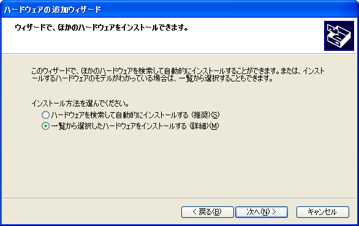
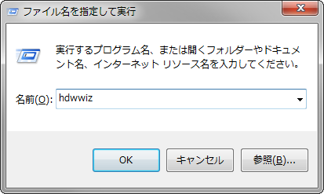
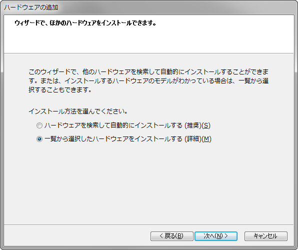

どうしても声を出したくない、話をする能力がないのでせめて機械声にでもしてお茶を濁したい―そんなあなたにオススメなのが音声合成です！
いわゆる「ゆっくり」と呼ばれる音声合成を Skype のマイク出力に設定する方法をご紹介します。

<!-- more -->

## 棒読みちゃんのセットアップ

1. [棒読みちゃん](https://chi.usamimi.info/Program/Application/BouyomiChan/)のホームページを開きます。
1. 中央の [ダウンロードはこちら] からダウンロードします。
1. ダウンロードしたファイルを展開（解凍）します。
1. 展開したファイルの中にある、唇のアイコンの BouyomiChan.exe を起動します。  
  
言わせたいことをテキストボックスに入力し、上部の再生ボタンを押すか Shift + Enter、F5 キーを押すなどすれば再生されます。

## サウンドドライバーのインストール

Skype はマイクから音声を入力しますが、棒読みちゃんの音声はスピーカーから出力されるだけです。
マイクに音声を拾わせることもできますが、音が割れてしまったり、ハウリングを起こしてしまったりしがちです。
そこでサウンドドライバーやステレオミキサーという機能を用いて、ソフトウェアで音声をマイクに入力するように設定します。

### ステレオミキサーがあるか確認する

1. [スタート] → [コントロール パネル] → [ハードウェアとサウンド] → [サウンド] または  
   [スタート] → [コントロール パネル] → [サウンド、音声、およびオーディオ デバイス] を開きます。
1. お使いのパソコンにステレオミキサーが搭載されているか確認します。  
   搭載されている場合は、ドライバー名を確認して棒読みちゃんの設定に移ります。  
   搭載されていない場合は、XP の場合 / Vista 以降の場合 の説明を読んで仮想サウンドドライバーをセットアップします。

### Windows XP の場合

1. [TiVSound Home Page](http://t-ishii.la.coocan.jp/hp/vs/) を開きます。
1. 中央の [ダウンロードページを開く] からダウンロードします。
1. [コントロール パネル] の [ハードウェアの追加] を開きます。
1. 出てきたダイアログボックスを [次へ(N) >] で進めます。
1. [はい、ハードウェアを接続しています(Y)] で進めます。
1. [新しいハードウェア デバイスの追加] を選択し、進めます。
1. [一覧から選択したハードウェアをインストールする (詳細)(M)] を選択し、進めます。  
   
1. [すべてのデバイスを表示] を選択し、進めます。
1. [ディスクの使用(H)] をクリックします。
1. [参照] ボタンで、ダウンロードしたドライバーの TiVSound.inf を指定します。
1. TiVSound (Virtual Audio Device) と表示されたら、進めます。
1. [次へ]、[このドライバをインストールします] で進めます。
1. アーカイブ内の TiVSSupporter をクリックして実行すれば完了です。

### Windows Vista 以降の場合

1. [kram.dip.jp](https://kram.nyamikan.net/#vadplus) を開きます。
1. [for Windows Vista (x86)] からダウンロードします。（Windows 7 でも動作確認済）
1. Windows キーを押しながら R キーを押し、出てきた画面に [hdwwiz] と入力します。  
   
1. 出てきたダイアログボックスを [次へ(N) >] で進めます。
1. [一覧から選択したハードウェアをインストールする (詳細)(M)] を選択し、進めます。  
   
1. [すべてのデバイスを表示] を選択し、進めます。
1. [ディスクの使用(H)] をクリックします。
1. [参照] ボタンで、ダウンロードしたドライバーの vadplus.inf を指定します。
1. VADplus (WDM) と表示されたら、進めます。
1. [次へ]、[このドライバをインストールします] で進め、インストール完了です。

## 棒読みちゃんの設定

棒読みちゃんの音声合成の出力先を、仮想サウンドドライバーに変更します。
通常のスピーカーから棒読みの音声が出なくなりますが、それで正常です。

1. 棒読みちゃんを起動します。
1. 設定アイコンより設定ウィンドウを開きます。
1. [システム] の [音声出力デバイス] の中でインストールしたドライバーをクリックします。
1. [OK] をクリックして終了します。
1. 棒読みちゃんを再起動し、音が出なくなれば成功です。

## Skype の設定

Skype の音声の入力元を、仮想サウンドドライバに変更します。

1. Skype を起動します。
1. [ツール] → [設定] から設定ウィンドウを開きます。
1. [マイク] から、先ほどインストールした仮想サウンドドライバーを指定します。  
   （Windows XP なら TiVSound、Windows Vista 以降なら VADplus）
1. [OK] をクリックして確定します。

Sound Test Service（echo123）に掛けて、音声が正しく繰り返されれば正常です。[マイクの接続を確認して下さい。] が表示されたら適当な文字を再生させると消せます。

## 合成音声が聞こえるようにする

実際に通話してみるとわかりますが、相手にしか合成音声は聞こえません。
どのように発音されたか気になっても確認することができないのは不便です。
そこで仮想サウンドドライバに出力された音声を、スピーカーに送ります。
そのために、サウンドルーティングソフト「猿ちぃ++」をインストールします。

1. [猿ちぃ03](http://vad.seesaa.net/article/135937715.html#03) を開きます。
1. SaRUty_03.zip からダウンロードします。
1. ファイルを展開して、SaRUty_01.exe を起動します。
1. IN：仮想サウンドドライバー（Windows XP なら TiVSound、Windows Vista 以降なら VADplus）  
   OUT：本物のスピーカー  
   と指定して [START] ボタンを押します。
1. 起動している間だけ音声が聞こえるようになります。（最小化しても大丈夫です）
