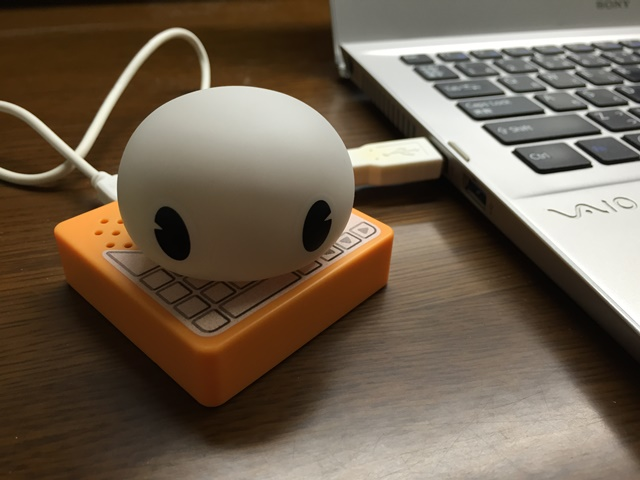
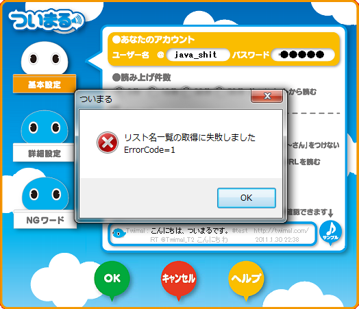
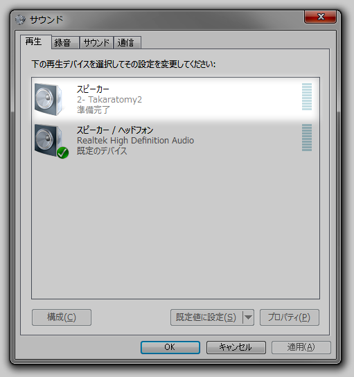
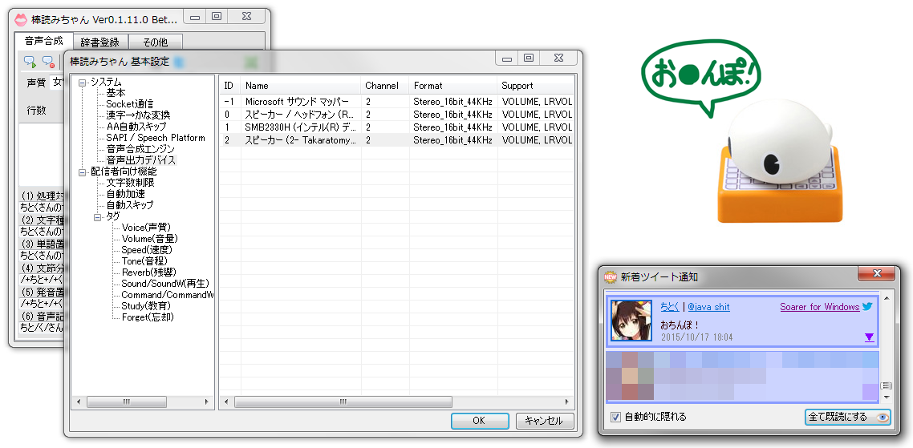

先日、会った途端に突然ぱくとま（[@pakutoma](https://twitter.com/pakutoma)）から渡されたついまるを試してみました。
現在ソフマップ秋葉原で 100 円で販売されているようです。ありがとうございます（？）

<!-- more -->

どうやらこの子、2011 年にタカラトミーから発売された Twitter のタイムラインを読み上げるおもちゃらしいのですが、Twitter API 1.1 に対応されることなく、要らない子となったらしいです。がんばって。

## まずは付属のソフトウェア……。

 

あっ（（察し

## とりあえず繋いでみた

というわけで Windows パソコンに繋いでみたところどうやら~~ただの USB スピーカーです。本当にありがとうございました。~~
そのままスピーカーとして使えそうな雰囲気。実際にシステムのサウンドの出力先を変更することで音声を流すことができました。

## 棒読みちゃんでタイムラインを読ませる

デバイスとしてはただのスピーカーなので、棒読みちゃんの音声出力先を変更することでついまるにツイートを読み上げさせることができます。

棒読みちゃんで Twitter の設定を行ったら、設定の [システム] → [音声出力デバイス] で Takaratomy2 を選択して OK をクリックするだけ。
あとはタイムラインが自動で読み上げられる家になります。素敵ですね、ぼくのタイムラインではできません（いろんな意味で）。

  

フォロ美………ごめんな。

## プログラム的なコメント

ついまるに付属するプログラムには VoiceText という音声合成ソフトウェアが内蔵されています。
当初はこのエンジンに音声を読み上げる方法を模索していたのですが、~~めっちゃめんどくさかった~~ライブラリーへのリンクが行えず、また当時の情報を集めることができなかったので断念しました。
目的は達成できたからいいよねってことで（完）
